<properties
    pageTitle="Kurz k SQL Database: Vytvoření databáze SQL | Microsoft Azure"
    description="Zjistěte, jak nastavit logický server služby SQL Database, pravidlo brány firewall serveru, databáze SQL a ukázková data. Zjistíte také, jak se připojit pomocí nástrojů klienta, konfigurovat uživatele a nastavit pravidlo brány firewall databáze."
    keywords="kurz k sql database, vytvoření databáze sql"
    services="sql-database"
    documentationCenter=""
    authors="CarlRabeler"
    manager="jhubbard"
    editor=""/>

<tags
    ms.service="sql-database"
    ms.workload="data-management"
    ms.tgt_pltfrm="na"
    ms.devlang="na"
    ms.topic="hero-article"
    ms.date="09/07/2016"
    ms.author="carlrab"/>

# Kurz k SQL Database: Vytvoření databáze SQL během pár minut pomocí webu Azure Portal

> [AZURE.SELECTOR]
- [portál Azure](sql-database-get-started.md)
- [C#](sql-database-get-started-csharp.md)
- [PowerShell](sql-database-get-started-powershell.md)

V tomto kurzu se naučíte, jak pomocí portálu Azure Portal:

- vytvořit databázi Azure SQL s ukázkovými daty,
- vytvořit pravidlo brány firewall na úrovni serveru pro jednu IP adresu nebo rozsah IP adres.

Stejné úlohy můžete provádět i pomocí jazyka [C#](sql-database-get-started-csharp.md) nebo prostředí [PowerShell](sql-database-get-started-powershell.md).

[AZURE.INCLUDE [Login](../../includes/azure-getting-started-portal-login.md)]

## Vytvoření první databáze Azure SQL 

1. Pokud nejste připojeni, připojte se k webu [Azure Portal](http://portal.azure.com).
2. Klikněte na **Nové**, klikněte na **Data + úložiště**, a vyhledejte **SQL Database**.

    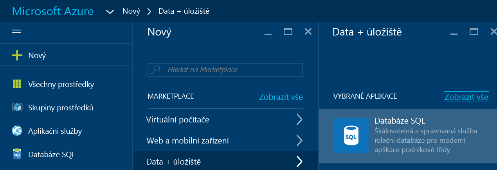

3. Kliknutím na **SQL Database** otevřete okno SQL Database. Obsah tohoto okna se liší v závislosti na počtu vašich předplatných a existujících objektů (jako jsou třeba existující servery).

    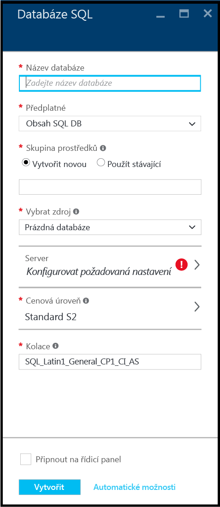

4. Do textového pole **Název databáze** zadejte název pro první databázi, třeba moje_databáze. Zelená značka zaškrtnutí označuje, že jste zadali platný název.

    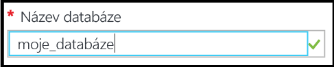

5. Pokud máte více předplatných, vyberte jedno z nich.
6. V části **Skupina prostředků** klikněte na **Vytvořit novou** a zadejte název pro první skupinu prostředků, třeba moje_skupina_prostředků. Zelená značka zaškrtnutí označuje, že jste zadali platný název.

    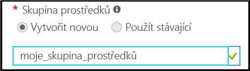

7. V části **Vybrat zdroj** klikněte na **Ukázka** a potom v části **vybrat ukázku** klikněte na **AdventureWorksLT [V12]**.

    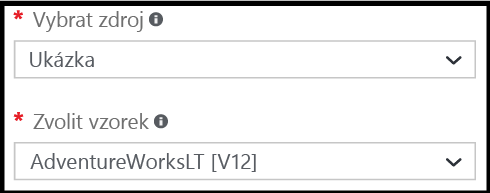

8. V části **Server** klikněte na **Konfigurovat požadovaná nastavení**.

    

9. V okně Server klikněte na **Vytvořit nový server**. V rámci objektu serveru (kterým může být nový nebo už existující server) se vytvoří databáze Azure SQL.

    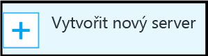

10. Prohlédněte si okno **Nový server** a seznamte se s informacemi, které musíte pro tento nový server zadat.

    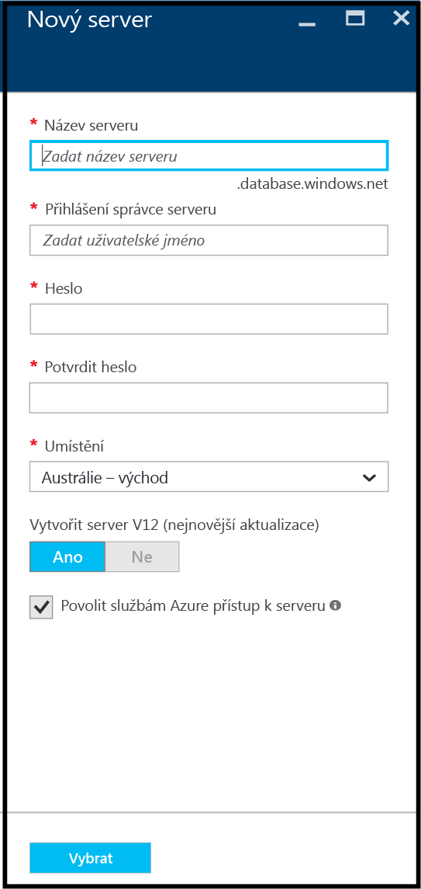

11. Do textového pole **Název serveru** zadejte název pro první server, třeba můj_nový_objekt_serveru. Zelená značka zaškrtnutí označuje, že jste zadali platný název.

    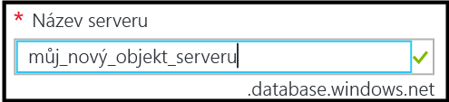
 
12. V části **Přihlášení správce serveru**přihlášení tohoto serveru, třeba můj_účet_správce. Toto přihlášení se označuje jako přihlášení objektu zabezpečení serveru. Zelená značka zaškrtnutí označuje, že jste zadali platný název.

    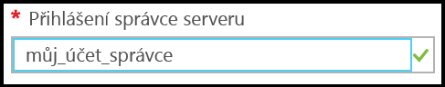

13. V části **Heslo** a **Potvrzení hesla** zadejte heslo pro přihlašovací účet objektu zabezpečení serveru, třeba p@ssw0rd1. Zelená značka zaškrtnutí označuje, že jste zadali platné heslo.

    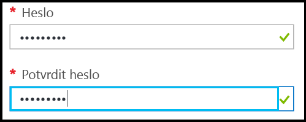
 
14. V části **Umístění** vyberte datacentrum odpovídající vašemu umístění, třeba Austrálie – východ.

    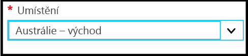

15. Všimněte si, že v části **Vytvořit server V12 (nejnovější aktualizace) máte možnost vytvořit jenom aktuální verzi serveru Azure SQL.

    

16. Všimněte si, že políčko **Povolit službám Azure přístup k serveru** je ve výchozím nastavení zaškrtnuté a není ho možné změnit. Jde o rozšířenou možnost. Toto nastavení je možné změnit v nastavení brány firewall serveru pro objekt serveru, ale ve většině případů to není potřeba.

    

17. Zkontrolujte položky vybrané v okně Nový server a potom kliknutím na **Vybrat** vyberte tento nový server pro vaši novou databázi.

    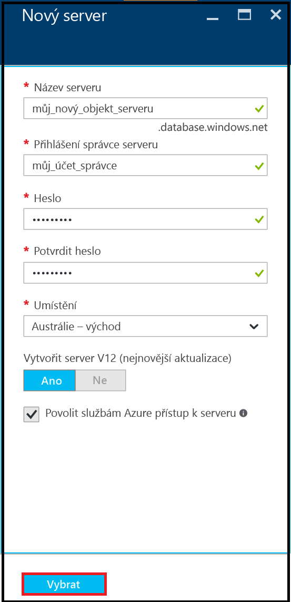

18. V okně SQL Database v části **Cenová úroveň**, klikněte na **S2 Standard** a potom klikněte na **Basic**. Pro svoji první databázi tak zvolíte nejlevnější cenovou úroveň. Cenovou úroveň můžete vždycky změnit později.

    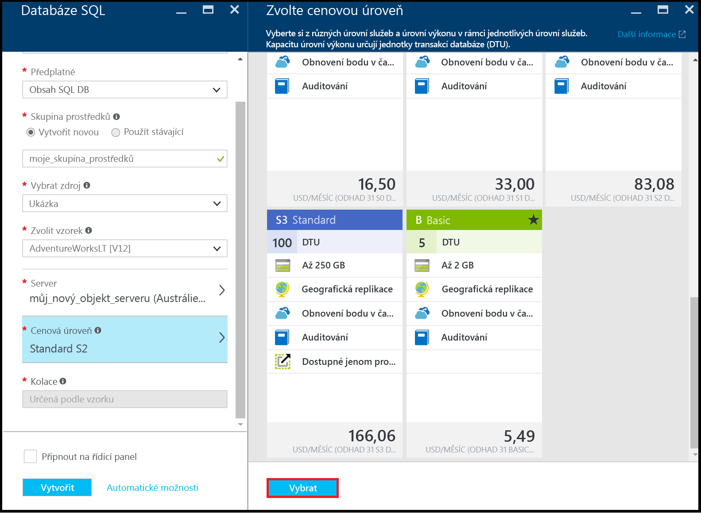

19. Zkontrolujte výběr v okně SQL Database a potom kliknutím na **Vytvořit** vytvořte svůj první server a databázi. Hodnoty, které jste zadali, se ověří a spustí se nasazení.

    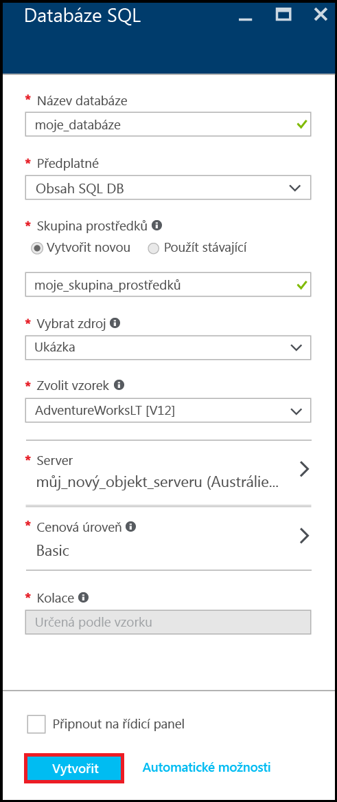

20. Na panelu nástrojů portálu klikněte na položky **Oznámení** a zkontrolujte stav vašeho nasazení.

    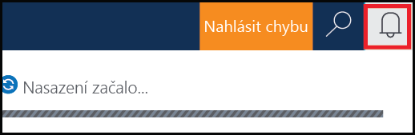

>[AZURE.IMPORTANT]Až se nasazení dokončí, jsou vaše nová databáze a server Azure SQL vytvořené v Azure. K novému serveru a databázi se můžete pomocí nástrojů SQL Serveru připojit, až když vytvoříte pravidlo brány firewall serveru, které otevře bránu firewall SQL Database pro připojení mimo Azure.

[AZURE.INCLUDE [Create server firewall rule](../../includes/sql-database-create-new-server-firewall-portal.md)]

## Další kroky
Nyní jste dokončili kurz k SQL Database a vytvořili jste databázi s ukázkovými daty. Jste tedy připraveni prozkoumávat pomocí svých oblíbených nástrojů.

- Pokud jste obeznámeni s jazykem Transact-SQL a aplikací SQL Server Management Studio (SSMS), zjistěte, jak [se pomocí SSMS k databázi SQL připojit a zadávat dotazy](sql-database-connect-query-ssms.md).

- Pokud znáte Excel, zjistěte, jak se [připojit k databázi SQL v Azure pomocí aplikace Excel](sql-database-connect-excel.md).

- Jste-li připraveni na psaní kódu, zvolte si programovací jazyk v tématu [Knihovny pro připojení ke službě SQL Database a systému SQL Server](sql-database-libraries.md).

- Chcete-li do Azure přesunout databáze z místního systému SQL Server, více zjistíte v tématu [Migrace databáze do služby SQL Database](sql-database-cloud-migrate.md).

- Chcete-li do nové tabulky načíst data ze souboru CSV pomocí nástroje příkazového řádku BCP, více zjistíte v tématu [Načtení dat do služby SQL Database ze souboru CSV pomocí BCP](sql-database-load-from-csv-with-bcp.md).

- Pokud se chcete začít seznamovat se zabezpečením Azure SQL Database, přečtěte si téma [Začínáme se zabezpečením](sql-database-get-started-security.md)

## Další zdroje

[Co je SQL Database?](sql-database-technical-overview.md)

<!----HONumber=Sep16_HO3-->

