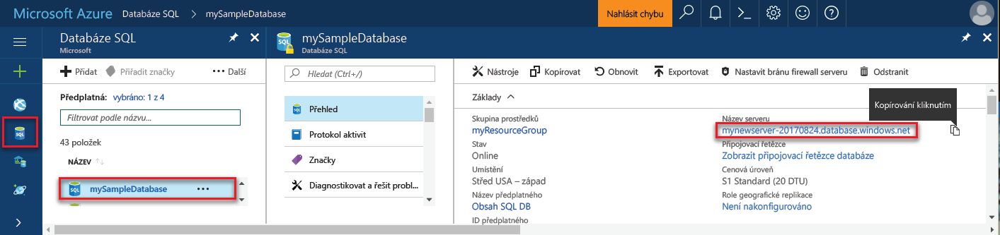
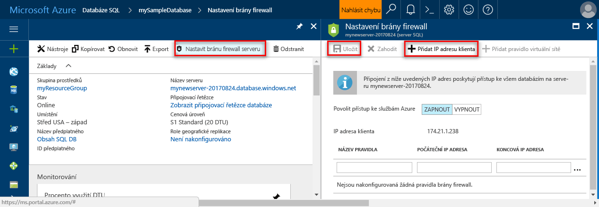
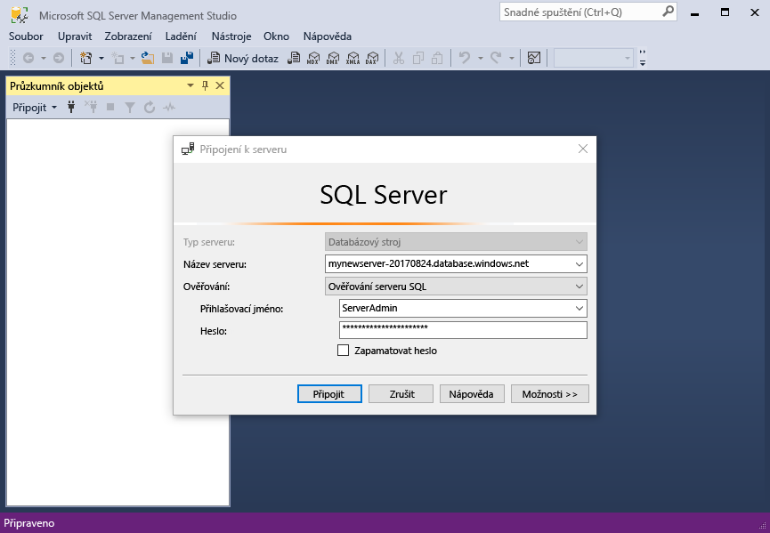
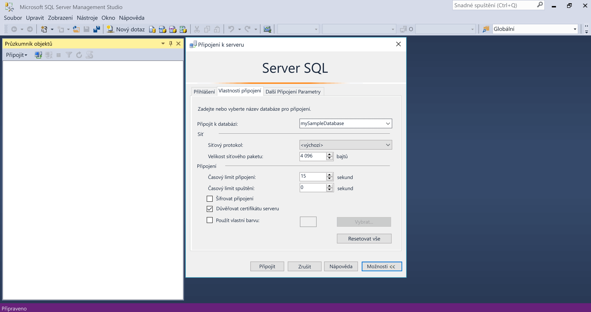
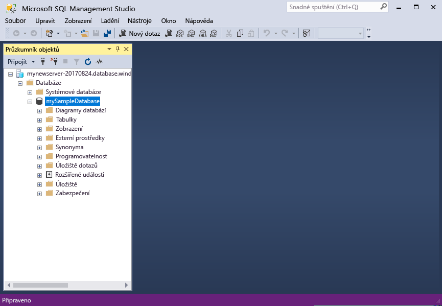

# <a name="migrate-your-sql-server-database-to-azure-sql-database"></a>Migrace databáze SQL Serveru do služby Azure SQL Database

K přesunu databáze SQL Serveru do služby Azure SQL Database stačí vytvořit prázdnou databázi SQL v Azure a pak použít nástroj [Data Migration Assistant](https://www.microsoft.com/download/details.aspx?id=53595) (DMA) k importu databáze do Azure. V tomto kurzu se naučíte:

> [!div class="checklist"]
> * Vytvořit na webu Azure Portal prázdnou databázi SQL Azure (s použitím nového nebo existujícího serveru Azure SQL Database)
> * Vytvořit na webu Azure Portal pravidlo brány firewall na úrovni serveru (pokud ještě není vytvořené)
> * Použít nástroj [Data Migration Assistant](https://www.microsoft.com/download/details.aspx?id=53595) (DMA) k importu vaší databáze SQL Serveru do prázdné databáze SQL Azure 
> * Použít aplikaci [SQL Server Management Studio](https://docs.microsoft.com/sql/ssms/download-sql-server-management-studio-ssms) (SSMS) ke změně vlastností databáze

Pokud ještě nemáte předplatné Azure, [vytvořte si bezplatný účet](https://azure.microsoft.com/free/) před tím, než začnete.

## <a name="prerequisites"></a>Požadavky

Předpokladem dokončení tohoto kurzu je splnění následujících požadavků:

- Instalace nejnovější verze aplikace [SQL Server Management Studio](https://docs.microsoft.com/sql/ssms/download-sql-server-management-studio-ssms) (SSMS).  
- Instalace nejnovější verze nástroje [Data Migration Assistant](https://www.microsoft.com/download/details.aspx?id=53595) (DMA).
- Určení a získání přístupu k databázi, kterou chcete migrovat. Tento kurz používá [databázi SQL Serveru 2008R2 AdventureWorks OLTP](https://msftdbprodsamples.codeplex.com/releases/view/59211) na instanci SQL Serveru 2008R2 nebo novější, ale můžete použít libovolnou databázi. Pokud chcete opravit problémy s kompatibilitou, použijte [SQL Server Data Tools](https://docs.microsoft.com/sql/ssdt/download-sql-server-data-tools-ssdt).

## <a name="log-in-to-the-azure-portal"></a>Přihlášení k portálu Azure Portal

Přihlaste se k portálu [Azure Portal](https://portal.azure.com/).

## <a name="create-a-blank-sql-database"></a>Vytvoření prázdné databáze SQL

Databáze SQL Azure se vytvoří s definovanou sadou [výpočetních prostředků a prostředků úložiště](sql-database-service-tiers.md). Databáze se vytvoří v rámci [skupiny prostředků Azure](../azure-resource-manager/resource-group-overview.md) a na [logickém serveru Azure SQL Database](sql-database-features.md). 

Pomocí následujících kroků vytvořte prázdnou databázi SQL. 

1. Klikněte na tlačítko **Nový** v levém horním rohu portálu Azure Portal.

2. Na stránce **Nový** vyberte **Databáze** a v části **Databáze SQL** na stránce **Nový** vyberte **Vytvořit**.

   

3. Vyplňte formulář databáze SQL pomocí následujících informací, jak je vidět na předchozím obrázku:   

   | Nastavení       | Navrhovaná hodnota | Popis | 
   | ------------ | ------------------ | ------------------------------------------------- | 
   | **Název databáze** | mySampleDatabase | Platné názvy databází najdete v tématu [Identifikátory databází](https://docs.microsoft.com/sql/relational-databases/databases/database-identifiers). | 
   | **Předplatné** | Vaše předplatné  | Podrobnosti o vašich předplatných najdete v tématu [Předplatná](https://account.windowsazure.com/Subscriptions). |
   | **Skupina prostředků** | myResourceGroup | Platné názvy skupin prostředků najdete v tématu [Pravidla a omezení pojmenování](https://docs.microsoft.com/azure/architecture/best-practices/naming-conventions). |
   | **Výběr zdroje** | Prázdná databáze | Určuje, že se má vytvořit prázdná databáze. |

4. Klikněte na **Server** a vytvořte a nakonfigurujte nový server pro novou databázi. Do **formuláře Nový server** zadejte následující informace: 

   | Nastavení       | Navrhovaná hodnota | Popis | 
   | ------------ | ------------------ | ------------------------------------------------- | 
   | **Název serveru** | Libovolný globálně jedinečný název | Platné názvy serverů najdete v tématu [Pravidla a omezení pojmenování](https://docs.microsoft.com/azure/architecture/best-practices/naming-conventions). | 
   | **Přihlašovací jméno správce serveru** | Libovolné platné jméno | Platná přihlašovací jména najdete v tématu [Identifikátory databází](https://docs.microsoft.com/sql/relational-databases/databases/database-identifiers).|
   | **Heslo** | Libovolné platné heslo | Heslo musí mít alespoň osm znaků a musí obsahovat znaky ze tří z následujících kategorií: velká písmena, malá písmena, číslice a jiné než alfanumerické znaky. |
   | **Umístění** | Libovolné platné umístění | Informace o oblastech najdete v tématu [Oblasti služeb Azure](https://azure.microsoft.com/regions/). |

   

5. Klikněte na **Vybrat**.

6. Klikněte na **Cenová úroveň** a zadejte úroveň služby, počet DTU a velikost úložiště. Prozkoumejte možnosti pro počet DTU a velikost úložiště, které máte k dispozici na jednotlivých úrovních služby. 

7. Pro účely tohoto kurzu vyberte úroveň služby **Standard** a pak pomocí posuvníku vyberte **100 DTU (S3)** a **400** GB úložiště.

   

8. Přijměte podmínky verze Preview pro použití možnosti **Doplňkové úložiště**. 

   > [!IMPORTANT]
   > \* Velikosti úložiště větší než velikost zahrnutého úložiště jsou ve verzi Preview a účtují se za ně další poplatky. Podrobnosti najdete na stránce s [cenami služby SQL Database](https://azure.microsoft.com/pricing/details/sql-database/). 
   >
   >\* Na úrovni Premium je úložiště větší než 1 TB aktuálně dostupné v následujících oblastech: Austrálie – východ, Austrálie – jihovýchod, Brazílie – jih, Kanada – střed, Kanada – východ, USA – střed, Francie – střed, Německo – střed, Japonsko – východ, Japonsko – západ, Korea – střed, Střed USA – sever, Severní Evropa, Střed USA – jih, Asie – jihovýchod, Velká Británie – jih, Velká Británie – západ, USA – východ 2, USA – západ, USA (Gov) – Virginia a Západní Evropa. Viz [Aktuální omezení pro P11–P15](sql-database-resource-limits.md#single-database-limitations-of-p11-and-p15-when-the-maximum-size-greater-than-1-tb).  
   > 

9. Po výběru úrovně služby, počtu DTU a velikosti úložiště klikněte na **Použít**.  

10. Vyberte **kolaci** pro prázdnou databázi (pro účely tohoto kurzu použijte výchozí hodnotu). Další informace o kolacích najdete v tématu [Kolace](https://docs.microsoft.com/sql/t-sql/statements/collations).

11. Po vyplnění formuláře pro SQL Database klikněte na **Vytvořit** a databázi zřiďte. Zřizování trvá několik minut. 

12. Na panelu nástrojů klikněte na **Oznámení** a sledujte proces nasazení.
    
     

## <a name="create-a-server-level-firewall-rule"></a>Vytvoření pravidla brány firewall na úrovni serveru

Služba SQL Database vytvoří bránu firewall na úrovni serveru, aby zabránila externím aplikacím a nástrojům v připojení k serveru nebo ke kterékoli databázi na serveru, pokud není vytvořené pravidlo brány firewall k otevření brány firewall pro konkrétní IP adresy. Postupujte podle těchto kroků a vytvořte [pravidlo brány firewall na úrovni serveru služby SQL Database](sql-database-firewall-configure.md) pro vaši IP adresu klienta a umožněte externí připojení přes bránu firewall služby SQL Database pouze pro vaši IP adresu. 

> [!NOTE]
> SQL Database komunikuje přes port 1433. Pokud se pokoušíte připojit z podnikové sítě, nemusí být odchozí provoz přes port 1433 bránou firewall vaší sítě povolený. Pokud je to tak, nebudete se moct připojit k serveru Azure SQL Database, dokud vaše IT oddělení neotevře port 1433.
>

1. Po dokončení nasazení klikněte na **Databáze SQL** z nabídky na levé straně a klikněte na **mySampleDatabase** na stránce **Databáze SQL**. Otevře se stránka s přehledem pro vaši databázi, na které se zobrazí plně kvalifikovaný název serveru (například **mynewserver-20170824.database.windows.net**) a možnosti pro další konfiguraci. 

2. Zkopírujte tento plně kvalifikovaný název serveru, abyste ho mohli použít pro připojení k serveru a jeho databázím v následujících rychlých startech. 

    

3. Na panelu nástrojů klikněte na **Nastavit bránu firewall serveru**. Otevře se stránka **Nastavení brány firewall** pro server služby SQL Database. 

    

4. Klikněte na **Přidat IP adresu klienta** na panelu nástrojů a přidejte svoji aktuální IP adresu do nového pravidla brány firewall. Pravidlo brány firewall může otevřít port 1433 pro jednu IP adresu nebo rozsah IP adres.

5. Klikněte na **Uložit**. Vytvoří se pravidlo brány firewall na úrovni serveru pro vaši aktuální IP adresu, které otevře port 1433 na logickém serveru.

6. Klikněte na **OK** a pak zavřete stránku **Nastavení brány firewall**.

Teď se můžete z této IP adresy připojit k serveru SQL Database a jeho databázím pomocí aplikace SQL Server Management Studio, nástroje Data Migration Assistant nebo jiného nástroje podle vašeho výběru s použitím účtu správce serveru vytvořeného předchozím postupem.

> [!IMPORTANT]
> Standardně je přístup přes bránu firewall služby SQL Database povolený pro všechny služby Azure. Kliknutím na **OFF** na této stránce provedete zákaz pro všechny služby Azure.

## <a name="sql-server-connection-information"></a>Informace o připojení k SQL serveru

Na webu Azure Portal získejte plně kvalifikovaný název serveru služby Azure SQL Database. Plně kvalifikovaný název serveru slouží k připojení k serveru SQL Azure pomocí klientských nástrojů, včetně nástroje Data Migration Assistant a aplikace SQL Server Management Studio.

1. Přihlaste se k portálu [Azure Portal](https://portal.azure.com/).
2. V nabídce vlevo vyberte **SQL Database** a na stránce **Databáze SQL** klikněte na vaši databázi. 
3. V podokně **Základy** na stránce webu Azure Portal pro vaši databázi vyhledejte a potom zkopírujte **Název serveru**.

   

## <a name="migrate-your-database"></a>Migrace databáze

Pomocí následujícího postupu použijte nástroj **[Data Migration Assistant](https://www.microsoft.com/download/details.aspx?id=53595)** k posouzení připravenosti vaší databáze na migraci do služby Azure SQL Database a k dokončení migrace.

1. Otevřete nátroj **Data Migration Assistant**. Pomocníka s migrací dat můžete spustit na jakémkoli počítači s připojením k instanci SQL Serveru obsahující databázi, kterou chcete migrovat, a s připojením k internetu. Nemusíte ho instalovat na počítač hostující instanci SQL Serveru, kterou migrujete. Pravidlo brány firewall, které jste vytvořili předchozím postupem, musí být určené pro počítač, na kterém spouštíte nástroj Data Migration Assistant.

     

2. V levé nabídce klikněte na **+ Nový** a vytvořte projekt **Posouzení**. Vyplňte požadované hodnoty a pak klikněte na **Vytvořit**.

   | Nastavení      | Navrhovaná hodnota | Popis | 
   | ------------ | ------------------ | ------------------------------------------------- | 
   | Typ projektu | Migrace | Zvolte buď posouzení databáze pro migraci, nebo posouzení a migraci v rámci stejného pracovního postupu. |
   |Název projektu|Kurz migrace| Popisný název |
   |Typ zdrojového serveru| SQL Server | Toto je jediný aktuálně podporovaný zdroj. |
   |Typ cílového serveru| Azure SQL Database| Možnosti jsou: Azure SQL Database, SQL Server a SQL Server na virtuálních počítačích Azure. |
   |Rozsah migrace| Schéma a data| Možnosti jsou: Schéma a data, pouze schéma a pouze data. |
   
   

3.  Na stránce **Výběr zdroje** vyplňte požadované hodnoty a pak klikněte na **Připojit**:

    | Nastavení      | Navrhovaná hodnota | Popis | 
    | ------------ | ------------------ | ------------------------------------------------- | 
    | Název serveru | Název nebo IP adresa vašeho serveru | Název nebo IP adresa vašeho serveru |
    | Typ ověřování | Upřednostňovaný typ ověřování| Možnosti: Ověřování systému Windows, Ověřování SQL Serveru, Integrované ověřování Active Directory a Ověřování hesla Active Directory |
    | Uživatelské jméno | Vaše přihlašovací jméno | Váš účet musí mít oprávnění **CONTROL SERVER**. |
    | Heslo| Vaše heslo | Vaše heslo |
    | Vlastnosti připojení| Odpovídajícím způsobem pro vaše prostředí vyberte možnosti **Šifrovat připojení** a **Důvěřovat certifikátu serveru**. | Zvolte odpovídající vlastnosti pro připojení k vašemu serveru. |

    

5. Vyberte ze svého zdrojového serveru jednu databázi, kterou chcete migrovat do služby Azure SQL Database, a pak klikněte na **Další**. Pro účely tohoto kurzu existuje pouze jedna databáze.

6. Na stránce **Výběr cíle** vyplňte požadované hodnoty a pak klikněte na **Připojit**:

    | Nastavení      | Navrhovaná hodnota | Popis | 
    | ------------ | ------------------ | ------------------------------------------------- | 
    | Název serveru | Plně kvalifikovaný název vašeho databázového serveru Azure | Plně kvalifikovaný název vašeho databázového serveru Azure z předchozího postupu |
    | Typ ověřování | Ověřování SQL Serveru | V době psaní tohoto kurzu je jedinou možností ověřování SQL Serveru, ale služba Azure SQL Database podporuje také integrované ověřování Active Directory a ověřování hesla Active Directory. |
    | Uživatelské jméno | Vaše přihlašovací jméno | Váš účet musí mít oprávnění **CONTROL DATABASE** ke zdrojové databázi. |
    | Heslo| Vaše heslo | Vaše heslo |
    | Vlastnosti připojení| Odpovídajícím způsobem pro vaše prostředí vyberte možnosti **Šifrovat připojení** a **Důvěřovat certifikátu serveru**. | Zvolte odpovídající vlastnosti pro připojení k vašemu serveru. |

    

7. Vyberte z cílového serveru databázi, kterou jste vytvořili předchozím postupem, a pak kliknutím na **Další** spusťte proces hodnocení schématu zdrojové databáze. Pro účely tohoto kurzu existuje pouze jedna databáze. Všimněte si, že úroveň kompatibility pro tuto databázi je nastavená na 140, což je výchozí úroveň kompatibility pro všechny nové databáze ve službě Azure SQL Database.

   > [!IMPORTANT] 
   > Po migraci databáze do služby Azure SQL Database se můžete z důvodu zajištění zpětné kompatibility rozhodnout databázi provozovat na zadané úrovni kompatibility. Další informace o důsledcích a možnostech provozu databáze na konkrétní úrovni kompatibility najdete v tématu [Úroveň kompatibility ALTER DATABASE](https://docs.microsoft.com/sql/t-sql/statements/alter-database-transact-sql-compatibility-level). V tématu věnovaném příkazu [ALTER DATABASE SCOPED CONFIGURATION](https://docs.microsoft.com/sql/t-sql/statements/alter-database-scoped-configuration-transact-sql) najdete také informace o dalších nastaveních na úrovni databáze souvisejících s úrovněmi kompatibility.
   >

8. Po dokončení procesu hodnocení schématu zdrojové databáze na stránce **Výběr objektů** zkontrolujte objekty vybrané k migraci a objekty, u kterých došlo k problémům. Zkontrolujte například změny chování **SERVERPROPERTY('LCID')** v objektu **dbo.uspSearchCandidateResumes** a změny fulltextového vyhledávání v objektu **HumanResourcesJobCandidate**. 

   > [!IMPORTANT] 
   > Když migrujete zdrojovou databázi, v závislosti na návrhu databáze a vaší aplikace možná budete muset po migraci (a v některých případech před migrací) upravit databázi, aplikaci nebo obojí. Informace o odlišnostech jazyka Transact-SQL, které můžou mít vliv na migraci, najdete v tématu [Řešení odlišností jazyka Transact-SQL během migrace do služby SQL Database](sql-database-transact-sql-information.md).

     

9. Kliknutím na **Vygenerovat skript SQL** vytvořte skript pro objekty schématu ve zdrojové databázi. 
10. Zkontrolujte vygenerovaný skript a pak podle potřeby klikněte na **Další problém** a zkontrolujte zjištěné problémy s vyhodnocením a doporučení. Například pro fulltextové vyhledávání se při upgradu doporučuje otestovat aplikaci s využitím fulltextových funkcí. Pokud chcete, skript si můžete uložit nebo zkopírovat.

     

11. Klikněte na **Nasadit schéma** a sledujte proces migrace schématu.

     

12. Po dokončení migrace schématu zkontrolujte ve výsledcích chyby a pak, za předpokladu, že k žádným nedošlo, klikněte na **Migrovat data**.
13. Na stránce **Výběr tabulek** zkontrolujte tabulky vybrané k migraci a pak klikněte na **Spustit migraci dat**.

     

14. Sledujte proces migrace.

     

## <a name="connect-to-the-database-with-ssms"></a>Připojení k databázi pomocí SSMS

Pomocí aplikace [SQL Server Management Studio](https://docs.microsoft.com/sql/ssms/sql-server-management-studio-ssms) navažte připojení k vašemu serveru Azure SQL Database.

1. Otevřete SQL Server Management Studio.

2. V dialogovém okně **Připojení k serveru** zadejte následující informace:

   | Nastavení       | Navrhovaná hodnota | Popis | 
   | ------------ | ------------------ | ------------------------------------------------- | 
   | Typ serveru | Databázový stroj | Tato hodnota se vyžaduje. |
   | Název serveru | Plně kvalifikovaný název serveru | Název by měl vypadat přibližně takto: **mynewserver20170824.database.windows.net**. |
   | Authentication | Ověřování SQL Serveru | Ověřování SQL je jediný typ ověřování, který jsme v tomto kurzu nakonfigurovali. |
   | Přihlásit | Účet správce serveru | Jedná se o účet, který jste zadali při vytváření serveru. |
   | Heslo | Heslo pro účet správce serveru | Jedná se o heslo, které jste zadali při vytváření serveru. |

   

3. Klikněte na **Možnosti** v dialogovém okně **Připojit k serveru**. V části **Připojit k databázi** zadejte **mySampleDatabase**, abyste se připojili k této databázi.

     

4. Klikněte na **Připojit**. V aplikaci SSMS se otevře okno Průzkumníka objektů. 

5. V Průzkumníku objektů zobrazte objekty v ukázkové databázi rozbalením **Databáze** a potom **mySampleDatabase**.

     

## <a name="change-database-properties"></a>Změna vlastností databáze

Pomocí aplikace SQL Server Management Studio můžete změnit úroveň služby, úroveň výkonu a úroveň kompatibility. Během fáze importu doporučujeme pro zajištění nejlepšího výkonu importovat do databáze na vyšší úrovni výkonu, ale po dokončení importu vertikálně snížit kapacitu, abyste ušetřili, dokud nebudete připraveni importovanou databázi aktivně používat. Změna úrovně kompatibility může přinést lepší výkon a přístup k nejnovějším možnostem služby Azure SQL Database. Při migraci starší databáze zůstane její úroveň kompatibility zachována na nejnižší podporované úrovni, která je kompatibilní s importovanou databází. Další informace najdete v tématu [Zvýšení výkonu dotazů s úrovní kompatibility 130 ve službě Azure SQL Database](sql-database-compatibility-level-query-performance-130.md).

1. V Průzkumníku objektů klikněte pravým tlačítkem na **mySampleDatabase** a pak klikněte na **Nový dotaz**. Otevře se okno dotazu připojené k vaší databázi.

2. Provedením následujícího příkazu nastavte úroveň služby na **Standard** a úroveň výkonu na **S1**.

    ```sql
    ALTER DATABASE mySampleDatabase 
    MODIFY 
        (
        EDITION = 'Standard'
        , MAXSIZE = 250 GB
        , SERVICE_OBJECTIVE = 'S1'
    );
    ```

## <a name="next-steps"></a>Další kroky 
V tomto kurzu jste se naučili:

> * Vytvořit na webu Azure Portal prázdnou databázi SQL Azure 
> * Vytvořit na webu Azure Portal bránu firewall na úrovni serveru 
> * Použít nástroj [Data Migration Assistant](https://www.microsoft.com/download/details.aspx?id=53595) (DMA) k importu vaší databáze SQL Serveru do prázdné databáze SQL Azure 
> * Použít aplikaci [SQL Server Management Studio](https://docs.microsoft.com/sql/ssms/download-sql-server-management-studio-ssms) (SSMS) ke změně vlastností databáze

V dalším kurzu se dozvíte, jak svou databázi zabezpečit.

> [!div class="nextstepaction"]
> [Zabezpečení služby Azure SQL Database](sql-database-security-tutorial.md)


