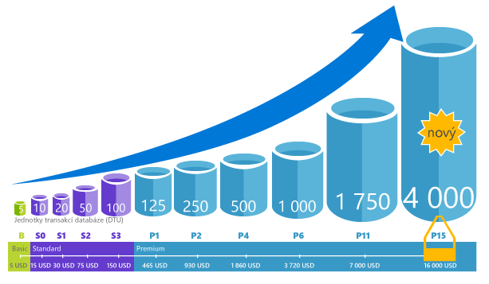

# Co je služba Azure SQL Database? 

SQL Database je služba relačních databází pro obecné účely v Microsoft Azure, která podporuje struktury, jako jsou relační data, JSON, prostorová data a XML. Zajišťuje [dynamicky škálovatelný výkon](sql-database-service-tiers.md) a nabízí možnosti jako [indexy columnstore](https://docs.microsoft.com/sql/relational-databases/indexes/columnstore-indexes-overview) pro extrémní analytické analýzy a generování sestav nebo [OLTP v paměti](sql-database-in-memory.md) pro extrémní zpracování transakcí. Microsoft zajišťuje bezproblémové opravy a aktualizace základního kódu SQL a odděluje veškerou správu základní infrastruktury. 

SQL Database sdílí základ kódu s [databázovým strojem Microsoft SQL Serveru](https://docs.microsoft.com/sql/sql-server/sql-server-technical-documentation). V rámci strategie Microsoftu zaměřené na cloud se nové funkce SQL Serveru uvolňují nejprve do služby SQL Database a až potom do samotného SQL Serveru. Tento přístup vám poskytuje nejnovější funkce SQL Serveru bez režijních nákladů na opravy nebo aktualizace. Kromě toho umožňuje testování těchto funkcí v milionech databází. Pokud se chcete o nových funkcích dozvědět hned po jejich oznámení, podívejte se na:

- **[Plány Azure do budoucna pro službu SQL Database:](https://azure.microsoft.com/roadmap/?category=databases)** Místo, kde můžete zjistit, co je nového a co se právě chystá. 
- **[Blog o službě Azure SQL Database:](https://azure.microsoft.com/blog/topics/database)** Místo, kde členové produktového týmu SQL Serveru píší o novinkách a funkcích služby SQL Database. 

SQL Database nabízí předvídatelný výkon na několika úrovních služeb, které poskytují dynamickou škálovatelnost bez přerušení provozu, integrovanou inteligentní optimalizaci, globální škálovatelnost a dostupnost a pokročilé možnosti zabezpečení – to vše téměř bez nutnosti jakékoli správy. Díky těmto možnostem se můžete zaměřit na rychlý vývoj aplikací a zkrácení doby dodání produktu na trh, namísto vynakládání prostředků a drahocenného času na správu virtuálních počítačů a infrastruktury. SQL Database je aktuálně v 38 datových centrech po celém světě a další datová centra se pravidelně přidávají, což vám umožňuje provozovat databázi v datovém centru ve vaší blízkosti.

> [!NOTE]
> Informace o bezpečnosti samotné platformy Azure najdete v [Centru zabezpečení Azure](https://azure.microsoft.com/support/trust-center/security/).
>

## Škálovatelnost výkonu a fondy

Ve službě SQL Database je každá databáze izolovaná od všech ostatních a má vlastní [úroveň služeb](sql-database-service-tiers.md) s garantovanou úrovní výkonu. SQL Database nabízí různé úrovně výkonu pro různé potřeby a umožňuje spojení databází do fondu pro maximalizaci využití prostředků a snížení nákladů.

### Úprava výkonu a škálování bez výpadků

SQL Database podporuje databázové úlohy od zcela nenáročných až po velmi náročné díky tomu, že nabízí čtyři úrovně služeb: Basic, Standard, Premium a Premium RS. S nízkými měsíčními náklady můžete sestavit svou první aplikaci s malou izolovanou databází a později ručně nebo programově změnit úroveň služby, aby splňovala požadavky vašeho řešení. Můžete upravit úroveň výkonu bez přerušení provozu aplikace a bez dopadu na vaše zákazníky. Dynamická škálovatelnost umožňuje databázím transparentně reagovat na rychle se měnící požadavky na prostředky a vy díky tomu platíte pouze za prostředky, které potřebujete, když je potřebujete.

   

### Elastické fondy pro maximalizaci využití prostředků

Řadě firem a aplikací stačí, že může vytvářet izolované databáze a nastavovat větší nebo menší výkon na vyžádání, zejména při relativně předvídatelném způsobu používání. Ale pokud vaše vzorce používání předvídatelné nejsou, může být správa nákladů a údržba obchodního modelu velmi těžká. [Elastické fondy](sql-database-elastic-pool.md) jsou navržené k řešení tohoto problému. Princip je jednoduchý. Prostředky výkonu přidělujete fondu, nikoli jednotlivým databázím, a platíte za souhrnné prostředky výkonu fondu místo placení za výkon izolovaných databází. 

   

S elastickými fondy se nemusíte starat o zvyšování a snižování výkonu databáze s kolísajícími požadavky na prostředky. Databáze ve fondu spotřebovávají prostředky výkonu elastického fondu podle potřeby. Databáze ve fondu spotřebovávají výkon, ale nepřekračují omezení fondu, takže vaše náklady budou předvídatelné, i když využívání jednotlivých databází odhadnutelné nebude. A navíc můžete [přidávat a odebírat databáze ve fondu](sql-database-elastic-pool-manage-portal.md), škálovat aplikace od několik databází k tisícům a přitom mít rozpočet stále pod kontrolou. Můžete také řídit minimální a maximální prostředky, které mají databáze ve fondu k dispozici, a tím zajistit, že žádná databáze ve fondu nebude využívat všechny prostředky fondu a pro každou databázi ve fondu bude garantováno minimální množství prostředků. Další informace o návrhových schématech aplikací SaaS využívajících elastické fondy najdete v tématu [Návrhová schémata pro víceklientské aplikace SaaS využívající službu SQL Database](sql-database-design-patterns-multi-tenancy-saas-applications.md).

### Kombinace izolovaných databází s databázemi ve fondu

Ať už si vyberete kteroukoli cestu – izolované databáze nebo elastické fondy – nejste k ní odsouzeni na věčné časy. Izolované databáze můžete kombinovat s elastickými fondy a snadno a rychle měnit úrovně služeb izolovaných databází a elastických fondů, abyste je přizpůsobili své situaci. S výkonem a dostupností, které Azure nabízí, můžete se službou SQL Database kombinovat další služby Azure podle konkrétních potřeb vašich aplikací pro zvýšení ekonomičnosti provozu a efektivity prostředků a otevírat tak zcela nové obchodní příležitosti.

### Rozsáhlé monitorování a možnosti upozorňování

Jak ale můžeme srovnávat relativní výkon izolovaných databází a elastických fondů? Jak poznáme správnou hodnotu nastavení při přidávání nebo ubírání výkonu? Můžete použít [integrované nástroje pro monitorování výkonu](sql-database-performance.md) a [upozorňování](sql-database-insights-alerts-portal.md) v kombinaci s hodnocením výkonu na základě [jednotek DTU (Database Transaction Unit) pro izolované databáze a elastických DTU (eDTU) pro elastické fondy](sql-database-what-is-a-dtu.md). Pomocí těchto nástrojů můžete rychle posoudit dopad vertikálního navýšení nebo snížení kapacity v závislosti na stávajících nebo předpokládaných požadavcích. Podrobnosti viz téma [Výkon a možnosti služby SQL Database: Co je k dispozici v jednotlivých úrovních služeb](sql-database-service-tiers.md).

Kromě toho může SQL Database [generovat metriky a diagnostické protokoly](sql-database-metrics-diag-logging.md) pro snazší monitorování. SQL Database můžete nakonfigurovat pro ukládání využití prostředků, pracovních procesů, relací a možností připojení do jednoho z těchto prostředků Azure:

- **Azure Storage:** Pro archivaci obrovských objemů telemetrických dat za nízkou cenu.
- **Centrum událostí Azure:** Pro integraci telemetrických dat služby SQL Database s vlastními řešeními monitorování nebo aktivními kanály.
- **Azure Log Analytics:** Pro integrované řešení monitorování s možnostmi pro generování sestav, upozorňování a omezení rizik.

    

## Možnosti dostupnosti

Dostupnost služby Azure se smlouvou o úrovní služeb [(SLA)](http://azure.microsoft.com/support/legal/sla/) dosahuje špičkové hodnoty 99,99 %, protože staví na globální síti Microsoftem spravovaných datových center. Může tedy udržet vaše aplikace v nepřetržitém provozu každý den po celý rok. Kromě toho SQL Database nabízí integrované funkce pro [provozní kontinuitu a globální škálovatelnost](sql-database-business-continuity.md), mezi které patří:

- **[Automatické zálohování:](sql-database-automated-backups.md)** SQL Database automaticky provádí úplné a rozdílové zálohování a zálohování protokolů transakcí.
- **[Obnovení k určitému bodu v čase:](sql-database-recovery-using-backups.md)** SQL Database podporuje obnovení k libovolnému bodu v čase v rámci doby uchování automatických záloh.
- **[Aktivní geografická replikace:](sql-database-geo-replication-overview.md)** SQL Database umožňuje konfigurovat až čtyři sekundární databáze s možností čtení ve stejném datovém centru nebo v globálně distribuovaných datových centrech.  Pokud například máte aplikaci SaaS s databází katalogu s velkým počtem souběžných transakcí jen pro čtení, použijte geografickou replikaci a umožněte globální škálovaní operací čtení a odstraňte problémová místa v hlavní databázi způsobená úlohami čtení. 
- **[Skupiny převzetí služeb při selhání:](sql-database-geo-replication-overview.md)** SQL Database umožňuje povolit vysokou dostupnost a vyrovnávání zatížení v globálním měřítku, včetně transparentní geografické replikace a převzetí služeb při selhání pro velké sady databází a elastické fondy. Skupiny převzetí služeb při selhání a aktivní geografická replikace umožňují vytváření globálně distribuovaných aplikací SaaS s minimálními nároky na správu. Veškeré komplexní monitorování, směrování a orchestraci převzetí služeb při selhání zajišťuje služba SQL Database.

## Integrované inteligentní funkce

Se službou SQL Database získáte integrované inteligentní funkce, které vám pomůžou výrazně snížit náklady na provoz a správu databází a maximalizovat výkon a zabezpečení aplikace. Během nepřetržitého spouštění milionů zákaznických úloh SQL Database shromažďuje a zpracovává obrovské množství telemetrických dat, přičemž zároveň plně respektuje ochranu osobních údajů zákazníků. Různé algoritmy neustále vyhodnocují telemetrická data, aby se služba mohla učit a přizpůsobovat vaší aplikaci. Na základě této analýzy služba nabízí doporučení pro vylepšení výkonu přizpůsobená pro konkrétní úlohu. 

### Automatické výkonu sledování a ladění

SQL Database nabízí podrobné přehledy dotazů, které potřebujete monitorovat. SQL Database zjistí aspekty vaší databáze a umožní vám přizpůsobit schéma databáze vaší úloze. Databáze SQL obsahuje [doporučení ladění výkonu](sql-database-advisor.md), kde můžete zkontrolovat vyladění akce a použít je. 

Neustálé monitorování databáze je však náročný a zdlouhavý úkol, zejména při práci s mnoha databázemi. [Inteligentní Statistika](sql-database-intelligent-insights.md) neobsahuje tuto úlohu pro vás automaticky sledováním výkonu databáze SQL ve velkém měřítku a informuje o snížení výkonu problémům s výkonem, identifikuje hlavní příčinu problému a poskytuje zlepšení výkonu doporučení, pokud je to možné.

Efektivní správa velkého počtu databází může být nemožná i se všemi dostupnými nástroji a sestavami, které SQL Database a Azure Portal nabízí. Místo sledování a ladění databázi ručně, můžete zvážit delegování některé sledování a ladění akce k databázi SQL pomocí [automatické ladění](sql-database-automatic-tuning.md). SQL Database automaticky aplikuje doporučení a testuje a ověřuje každou z akcí optimalizace pro zajištění stálého vylepšování výkonu. Díky tomu se služba SQL Database může automaticky přizpůsobit vaší úloze řízeným a bezpečným způsobem. Automatická optimalizace znamená, že se výkon vaší databáze pečlivě monitoruje a porovnává před a po každé akci optimalizace, a pokud se výkon nezlepší, akce optimalizace se vrátí zpět.

V současné době se mnoho našich partnerů provozujících [víceklientské aplikace SaaS](sql-database-design-patterns-multi-tenancy-saas-applications.md) nad službou SQL Database spoléhá na automatickou optimalizaci výkonu pro zajištění, že jejich aplikace budou mít vždy stabilní a předvídatelný výkon. Tato funkce pro ně výrazně snižuje riziko incidentu výkonu uprostřed noci. Vzhledem k tomu, že část jejich zákazníků také používá SQL Server, můžou navíc s využitím stejných doporučení indexování získaných ze služby SQL Database pomáhat svým zákazníkům s SQL Serverem.

Existují dva automatické ladění aspekty, které jsou [dostupných v databázi SQL](sql-database-automatic-tuning.md):

- **Správa automatického indexu**: identifikuje indexy, které mají být přidány do databáze a indexy, které má být odebrána.
- **Automatické plán oprava**: identifikuje problematické plány a řeší problémy s výkonem plán SQL (již brzy, již k dispozici v SQL serveru 2017).

### Adaptivní zpracování dotazů

Do služby SQL Database přidáváme také řadu funkcí pro [adaptivní zpracování dotazů](/sql/relational-databases/performance/adaptive-query-processing), včetně prokládaného spouštění funkcí s více příkazy vracejících tabulky, odezvy přidělení paměti v režimu dávky a adaptivních příkazů join v režimu dávky. Každá z těchto funkcí pro adaptivní zpracování dotazů používá podobné techniky učení a adaptace a pomáhá tak dále řešit problémy s výkonem související s historicky nezvladatelnými problémy s optimalizací dotazů.

### Inteligentní detekce hrozeb

 [Detekce hrozeb SQL](sql-database-threat-detection.md) využívá [auditování služby SQL Database](sql-database-auditing.md) k nepřetržitému monitorování databází Azure SQL a detekci potencionálně škodlivých pokusů o přístup k citlivým datům. Detekce hrozeb SQL poskytuje novou vrstvu zabezpečení, která zákazníkům umožňuje díky poskytování upozornění zabezpečení na neobvyklé aktivity detekovat a reagovat na potenciální hrozby, když k nim dojde. Uživatelé obdrží upozornění při podezřelých databázových aktivitách, potenciálních ohroženích zabezpečení, útocích prostřednictvím injektáže SQL a neobvyklých vzorcích přístupu k databázi. Upozornění detekce hrozeb SQL obsahují podrobnosti o podezřelé aktivitě a doporučení akce k prošetření a zmírnění hrozby. Uživatelé můžou prozkoumat podezřelé události a určit, jestli jsou důsledkem pokusu o přístup, porušení zabezpečení nebo zneužití dat v databázi. Detekce hrozeb usnadňuje řešení potenciálních ohrožení databáze, aniž byste museli být odborníkem na zabezpečení nebo museli spravovat pokročilé systémy monitorování zabezpečení.

## Pokročilé zabezpečení a dodržování předpisů

SQL Database nabízí řadu [integrovaných funkcí zabezpečení a dodržování předpisů](sql-database-security-overview.md), které vaší aplikaci pomůžou se splněním nejrůznějších požadavků na zabezpečení a dodržování předpisů. 

### Auditování dodržování předpisů a zabezpečení

[Auditování služby SQL Database](sql-database-auditing.md) sleduje události databáze a zapisuje je do protokolu auditu ve vašem účtu Azure Storage. Auditování pomáhá zajistit dodržování předpisů, porozumět databázové aktivitě a získat přehled o nesrovnalostech a anomáliích, které můžou značit problémy obchodního charakteru nebo vzbuzovat podezření na narušení zabezpečení.

### Šifrování v klidovém stavu

[Transparentní šifrování dat](/sql/relational-databases/security/encryption/transparent-data-encryption-azure-sql) služby SQL Database pomáhá chránit před hrozbou škodlivé aktivity tím, že v reálném čase provádí šifrování a dešifrování databáze, přidružených záloh a souborů protokolů transakcí v klidovém stavu a nevyžaduje žádné změny aplikace. Od května 2017 jsou všechny nově vytvořené databáze Azure SQL automaticky chráněné pomocí transparentního šifrování dat (TDE). TDE je prověřená technologie SQL pro šifrování v klidovém stavu, kterou vyžaduje řada standardů dodržování předpisů z důvodu ochrany před krádeží úložného média. Zákazníci můžou bezpečně a s ohledem na dodržování předpisů spravovat šifrovací klíče TDE a další tajné klíče pomocí Azure Key Vault.

### Šifrování přenášených dat

Služba SQL Database je jediný databázový systém, který nabízí ochranu citlivých dat při přenosu, v neaktivním stavu a během zpracování dotazů pomocí funkce [Always Encrypted](https://docs.microsoft.com/sql/relational-databases/security/encryption/always-encrypted-database-engine). Funkce Always Encrypted je špičkou v odvětví, která nabízí bezkonkurenční zabezpečení dat před porušením zabezpečení, včetně krádeže důležitých dat. S povolenou funkcí Always Encrypted se například čísla platebních karet zákazníků ukládají v databázi vždy v zašifrované podobě, dokonce i během zpracování dotazů, s možností jejich dešifrování pro účely zpracování těchto dat v době použití ověřeným zaměstnancem nebo aplikací.

### Dynamické maskování dat

[Dynamické maskování dat služby SQL Database](sql-database-dynamic-data-masking-get-started.md) omezuje riziko ohrožení citlivých dat pomocí jejich maskování pro neoprávněné uživatele. Dynamické maskování dat pomáhá předcházet neoprávněnému přístupu k citlivým datům tím, že uživatelům umožňuje určit, kolik citlivých dat se může odhalit, aby to mělo minimální dopad na aplikační vrstvu. Je to funkce zabezpečení založená na zásadách, která skrývá citlivá data v sadě výsledků dotazu nad určenými poli databáze, zatímco data v databázi se nemění.

### Zabezpečení na úrovni řádku

[Zabezpečení na úrovni řádku](https://docs.microsoft.com/sql/relational-databases/security/row-level-security) umožňuje řízení přístupu k řádkům v databázové tabulce na základě charakteristiky uživatele spouštějícího dotaz (například podle členství ve skupině nebo kontextu spuštění). Zabezpečení na úrovni řádku (RLS) zjednodušuje návrh a psaní kódu zabezpečení v aplikaci. RLS umožňuje implementovat omezení přístupu k datovým řádkům. Například pro zajištění, že pracovníci mají přístup pouze k datovým řádkům, které se vztahují k jejich oddělení, nebo pro omezení přístupu zákazníků pouze k datům souvisejícím s jejich společností.

### Integrace s Azure Active Directory a vícefaktorové ověřování

SQL Database umožňuje centrálně spravovat identity uživatele databáze a dalších služeb Microsoft pomocí [integrace s Azure Active Directory](sql-database-aad-authentication.md). Tato možnost zjednodušuje správu oprávnění a zvyšuje zabezpečení. Azure Active Directory podporuje [služby Multi-Factor authentication](sql-database-ssms-mfa-authentication.md) (MFA) a zvýšit zabezpečení dat a aplikací při podpora jeden proces přihlášení.

### Certifikace dodržování předpisů

Služba SQL Database se účastní pravidelných auditů a byla certifikována pro řadu standardů dodržování předpisů. Další informace najdete v [Centru zabezpečení Microsoft Azure](https://azure.microsoft.com/support/trust-center/), kde také najdete nejnovější seznam [certifikátů služby SQL Database v oblasti dodržování předpisů](https://azure.microsoft.com/support/trust-center/services/).

## Snadno použitelné nástroje

SQL Database zjednodušuje a zefektivňuje vytváření a správu aplikací. SQL Database vám umožňuje soustředit se na to, v čem jste nejlepší – na vytváření skvělých aplikací. Ve službě SQL Database můžete vyvíjet a provádět správu pomocí nástrojů a dovedností, které už máte.

- **[Azure Portal:](https://portal.azure.com/)** Webová aplikace pro správu všech služeb Azure. 
- **[SQL Server Management Studio:](https://docs.microsoft.com/sql/ssms/download-sql-server-management-studio-ssms)** Bezplatná klientská aplikace ke stažení pro správu jakékoli infrastruktury SQL, od SQL Serveru až po službu SQL Database.
- **[SQL Server Data Tools v sadě Visual Studio:](https://docs.microsoft.com/sql/ssdt/download-sql-server-data-tools-ssdt)** Bezplatná klientská aplikace ke stažení pro vývoj relačních databází SQL Serveru, databází Azure SQL, balíčků služby SSIS, datových modelů služby Analysis Services a sestav služby Reporting Services.
- **[Visual Studio Code:](https://code.visualstudio.com/docs)** Bezplatný opensourcový editor kódu ke stažení pro Windows, MacOS a Linux, který podporuje rozšíření, včetně [rozšíření mssql](https://aka.ms/mssql-marketplace) pro dotazování Microsoft SQL Serveru, služby Azure SQL Database a služby SQL Data Warehouse.

SQL Database podporuje vytváření aplikací pomocí Pythonu, Javy, Node.js, PHP, Ruby a .NET v systémech MacOS, Linux a Windows. SQL Database podporuje stejné [knihovny připojení](sql-database-libraries.md) jako SQL Server.

## Spolupráce s technickým týmem SQL Serveru

- [DBA na webu Stack Exchange](https://dba.stackexchange.com/questions/tagged/sql-server): Pokládání dotazů týkajících se správy databází
- [Stack Overflow](http://stackoverflow.com/questions/tagged/sql-server): Pokládání dotazů týkajících se vývoje
- [Fóra na webu MSDN](https://social.msdn.microsoft.com/Forums/en-US/home?category=sqlserver): Pokládání technických dotazů
- [Microsoft Connect](https://connect.microsoft.com/SQLServer/Feedback): Hlášení chyb a žádosti o funkce
- [Reddit](https://www.reddit.com/r/SQLServer/): Diskuze o SQL Serveru

## Další kroky

- Na [stránce s cenami](https://azure.microsoft.com/pricing/details/sql-database/) najdete cenové kalkulačky a srovnání cen izolovaných databází a elastických fondů.

- Tyto rychlé starty vám pomůžou začít:

  - [Vytvoření databáze SQL na webu Azure Portal](sql-database-get-started-portal.md)  
  - [Vytvoření databáze SQL pomocí Azure CLI](sql-database-get-started-cli.md)
  - [Vytvoření databáze SQL pomocí PowerShellu](sql-database-get-started-powershell.md)

- Řadu ukázek v Azure CLI a PowerShellu najdete tady:
  - [Ukázky v Azure CLI pro službu SQL Database](sql-database-cli-samples.md)
  - [Ukázky v Azure PowerShellu pro službu SQL Database](sql-database-powershell-samples.md)
