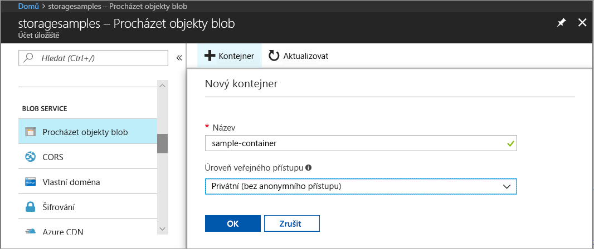
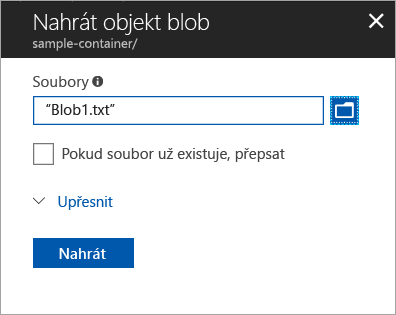
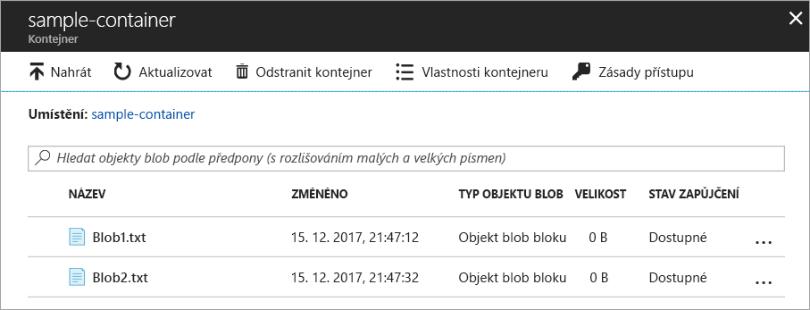
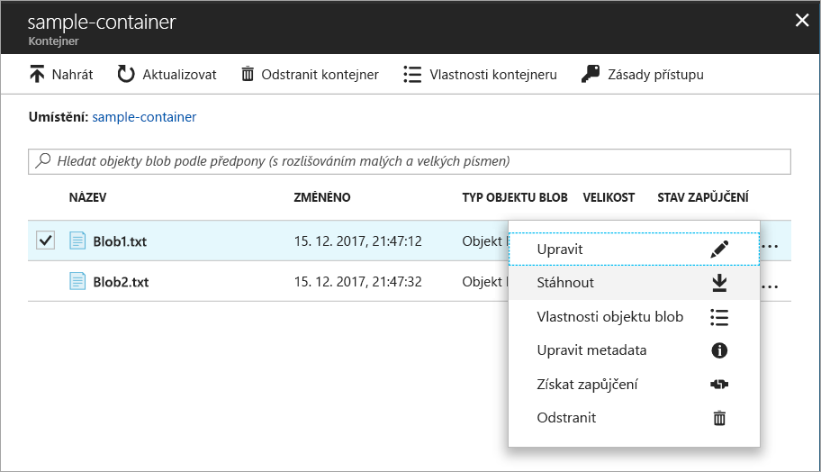
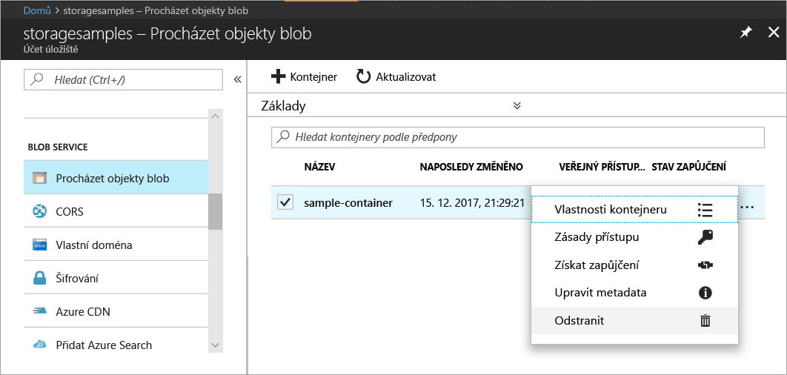

# Přenos objektů do a z úložiště objektů blob v Azure pomocí webu Azure Portal

V tomto rychlém startu se naučíte použít web [Azure Portal](https://portal.azure.com/) k vytvoření kontejneru ve službě Azure Storage a k odeslání a stažení objektů blob bloku v tomto kontejneru.

## Požadavky

Pokud ještě nemáte předplatné Azure, vytvořte si [bezplatný účet](https://azure.microsoft.com/free/?WT.mc_id=A261C142F) před tím, než začnete.

[!INCLUDE [storage-quickstart-tutorial-create-account-portal](../../../includes/storage-quickstart-tutorial-create-account-portal.md)]

## Vytvoření kontejneru

Při vytváření kontejneru na webu Azure Portal použijte tento postup:

1. Na webu Azure Portal přejděte k novému účtu úložiště.
2. V levé nabídce pro účet úložiště přejděte do části **Blob Service** a potom vyberte **Procházet objekty blob**.
3. Klikněte na tlačítko **Přidat kontejner**.
4. Zadejte název nového kontejneru. Názvy kontejnerů musí obsahovat malá písmena, musí začínat písmenem nebo číslicí a smí obsahovat jenom písmena, číslice a pomlčky (-). Další informace o pojmenování kontejnerů a objektů blob najdete v tématu [Názvy kontejnerů, objektů blob a metadat a odkazování na ně](https://docs.microsoft.com/rest/api/storageservices/naming-and-referencing-containers--blobs--and-metadata).
5. Nastavte úroveň veřejného přístupu ke kontejneru. Výchozí úroveň je **Privátní (bez anonymního přístupu)**.
6. Kliknutím na tlačítko **OK** kontejner vytvoříte.

    

## Nahrání objektu blob bloku

Objekty blob bloku se skládají z bloků dat sestavených do objektu blob. Většina scénářů využívajících Blob Storage zahrnuje objekty blob bloku. Objekty blob bloku jsou ideální pro ukládání textových a binárních dat v cloudu, jako jsou soubory, image a videa. Tento rychlý start ukazuje, jak pracovat s objekty blob bloku. 

Pokud chcete do nového kontejneru na webu Azure Portal nahrát objekt blob bloku, použijte tento postup:

1. Na webu Azure Portal přejděte do kontejneru, který jste vytvořili v předchozí části.
2. Vyberte tento kontejner. Zobrazí se seznam objektů blob, které obsahuje. Vzhledem k tomu, že jste vytvořili nový kontejner, nebude ještě obsahovat žádné objekty blob.
3. Klikněte na tlačítko **Nahrát** a nahrajte objekt blob do kontejneru.
4. Projděte místní systém souborů a vyhledejte soubor, který chcete nahrát jako objekt blob bloku, a klikněte na **Nahrát**.
     
    

5. Tímto způsobem můžete nahrát libovolný počet objektů blob. Uvidíte, že nové objekty blob jsou teď zařazené v kontejneru.

    

## Stažení objektu blob bloku

Objekt blob bloku si můžete si stáhnout a zobrazit v prohlížeči nebo uložit do místního systému souborů. Pokud chcete stáhnout objekt blob bloku, postupujte takto:

1. Přejděte k seznamu objektů blob, které jste nahráli v předchozí části. 
2. Vyberte objekt blob ke stažení.
3. Klikněte pravým tlačítkem myši na tlačítko **Další** (**...** ) a vyberte **Stáhnout**. 

## Vyčištění prostředků

Pokud chcete odebrat prostředky, které jste vytvořili v tomto rychlém startu, můžete jednoduše odstranit příslušný kontejner. Všechny objekty blob v kontejneru se také odstraní.

Odstranění kontejneru:

1. Na webu Azure Portal přejděte k seznamu kontejnerů ve vašem účtu úložiště.
2. Vyberte kontejner, který chcete odstranit.
3. Klikněte pravým tlačítkem myši na tlačítko **Další** (**...** ) a vyberte **Odstranit**.
4. Potvrďte, že chcete kontejner skutečně odstranit.

       

## Další kroky

V tomto rychlém startu jste zjistili, jak přenášet soubory mezi místním diskem a úložištěm objektů blob v Azure pomocí .NET. Další informace o práci s úložištěm objektů blob najdete v postupech pro úložiště objektů blob.

> [!div class="nextstepaction"]
> [Operace s úložištěm objektů blob – postupy](storage-dotnet-how-to-use-blobs.md)

