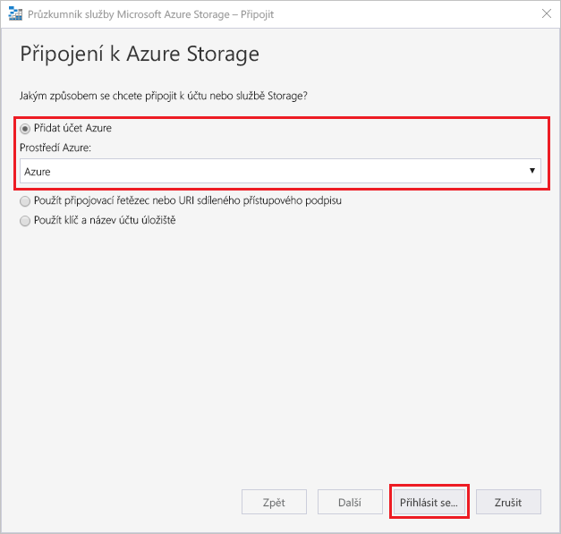
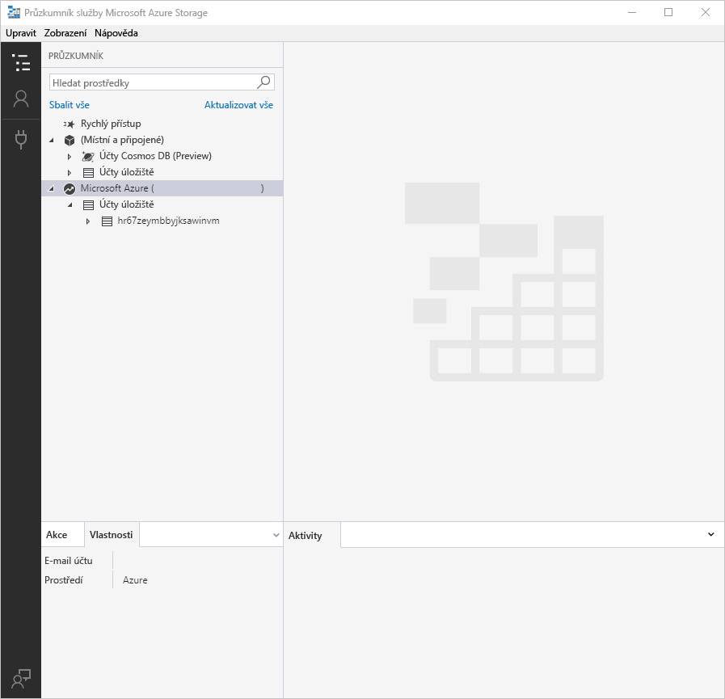
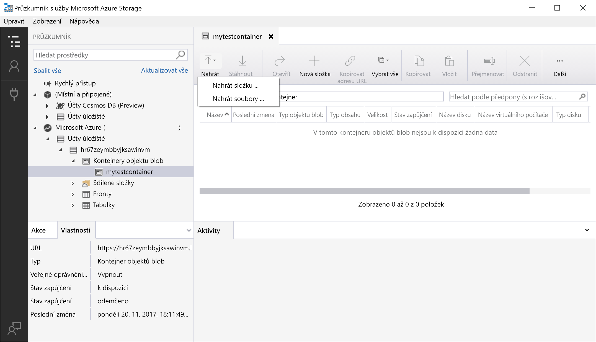
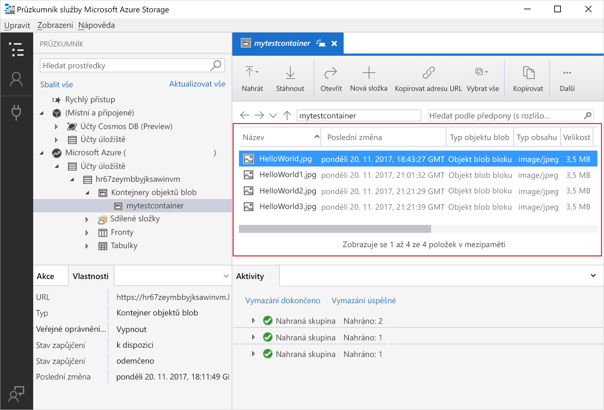
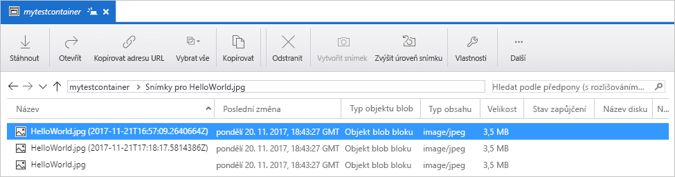
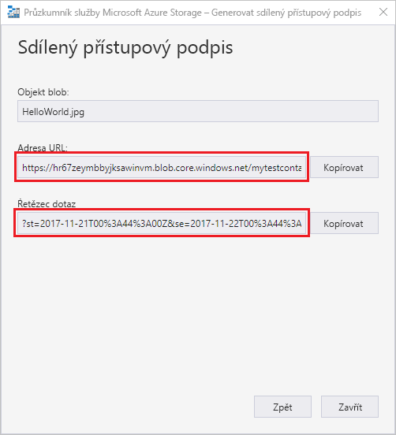

# Přenášení objektů do a z úložiště objektů blob v Azure pomocí Průzkumníka služby Azure Storage

[Průzkumník služby Azure Storage](https://azure.microsoft.com/features/storage-explorer/) je multiplatformní uživatelské rozhraní pro správu obsahu vašeho účtu úložiště. Tento článek podrobně popisuje použití Průzkumníka služby Azure Storage k přenosu souborů mezi místním diskem a úložištěm objektů blob v Azure.

Pokud ještě nemáte předplatné Azure, vytvořte si [bezplatný účet](https://azure.microsoft.com/free/?WT.mc_id=A261C142F) před tím, než začnete.

Tento postup vyžaduje instalovaného Průzkumníka služby Azure Storage. Pokud ho potřebujete nainstalovat, na stránce [Průzkumníka služby Azure Storage](https://azure.microsoft.com/features/storage-explorer/) si ho můžete stáhnout pro Windows, Macintosh nebo Linux.

[!INCLUDE [storage-quickstart-tutorial-create-account-portal](../../../includes/storage-quickstart-tutorial-create-account-portal.md)]

## Přihlášení do Průzkumníka služby Storage

Při prvním spuštění se objeví okno **Průzkumník služby Microsoft Azure Storage – Připojení**. Průzkumník služby Storage nabízí několik způsobů, jak se připojit k účtům úložiště. Rozdíly mezi jednotlivými způsoby připojení jsou uvedené v následující tabulce:

|Úkol|Účel|
|---|---|
|Přidání účtu Azure | Přesměruje vás na přihlašovací stránku vaší organizace, kde budete moci ověřit svůj přístup do Azure. |
|Použití připojovacího řetězce nebo sdíleného přístupového podpisu URI | Ty můžete použít k přímému přístupu ke kontejneru nebo účtu úložiště pomocí tokenu SAS nebo sdíleného připojovacího řetězce. |
|Použití názvu a klíče účtu úložiště| Pro připojení k úložišti Azure můžete použít název a klíč.|

Vyberte **Přidat účet Azure** a klikněte na tlačítko **Přihlásit...** Podle pokynů na obrazovce se přihlaste ke svému účtu Azure.

Po dokončení připojení se Průzkumník služby Azure Storage otevře se zobrazenou kartou **Průzkumník**. V tomto zobrazení uvidíte místní úložiště i přehled všech svých účtů úložiště Azure nakonfigurovaných pomocí účtů [emulátoru úložiště Azure](../common/storage-use-emulator.md?toc=%2fazure%2fstorage%2fblobs%2ftoc.json), [Cosmos DB](../../cosmos-db/storage-explorer.md?toc=%2fazure%2fstorage%2fblobs%2ftoc.json) nebo prostředí [Azure Stack](../../azure-stack/user/azure-stack-storage-connect-se.md?toc=%2fazure%2fstorage%2fblobs%2ftoc.json).

## Vytvoření kontejneru

Objekty blob se vždy nahrávají do kontejneru. Díky tomu můžete organizovat skupiny objektů blob podobně, jako organizujete soubory do složek na svém počítači.

Pokud chcete vytvořit kontejner, rozbalte účet úložiště, který jste vytvořili v předchozím kroku. Klikněte pravým tlačítkem na **Kontejnery objektů blob** a vyberte **Vytvořit kontejner objektů blob**. Zadejte název kontejneru objektů blob. V části popisující [pravidla pojmenování kontejneru](storage-dotnet-how-to-use-blobs.md#create-a-container) najdete seznam pravidel a omezení pro pojmenování kontejnerů. Až budete hotovi, stisknutím **Enter** vytvoříte kontejner objektů blob. Až se kontejner objektů blob úspěšně vytvoří, zobrazí se ve složce **Kontejnery objektů blob** v příslušném účtu úložiště.

## Nahrání objektů blob do kontejneru

Úložiště objektů blob podporuje objekty blob bloku, doplňovací objekty blob a objekty blob stránky. Soubory VHD, které se používají pro virtuální počítače IaaS, jsou objekty blob stránky. Doplňovací objekty blob se používají k protokolování, například když chcete zapisovat do souboru a pak přidávat další informace. Většina souborů uložených v úložišti objektů blob je objekty blob bloku.

Na pásu karet kontejneru vyberte **Nahrát**. Tato operace umožňuje nahrát složku nebo soubor.

Vyberte soubory nebo složku k nahrání. Vyberte **typ blobu**. K dispozici jsou možnosti **Připojit**, **Stránka** nebo **Blok**.

Pokud chcete nahrát soubor .vhd nebo .vhdx, zvolte **Nahrát soubory .vhd/.vhdx jako objekty blob stránky (doporučeno)**.

V poli **Nahrát do složky (volitelné)** zadejte název složky pro uložení souborů nebo složky v rámci kontejneru. Pokud nevyberete žádnou složku, nahrané soubory se uloží přímo do kontejneru.

Když vyberete **OK**, vybrané soubory se zařadí do fronty a postupně se nahrají. Po dokončení nahrávání se výsledky zobrazí v okně **Aktivity**.

## Zobrazení objektů blob v kontejneru

V **Průzkumníku služby Storage** vyberte kontejner pod účtem úložiště. V hlavním podokně se zobrazí seznam objektů blob ve vybraném kontejneru.

## Stáhnout objekty blob

Když chcete stáhnout objekty blob pomocí **Průzkumníka služby Azure Storage**, vyberte objekt blob a pak na pásu karet **Stáhnout**. Otevře se dialogové okno pro výběr souboru, kde můžete zadat umístění a název staženého souboru. Výběrem **Uložit** zahájíte stahování objektu blob do místní složky.

## Správa snímků

Průzkumník služby Azure Storage umožňuje vytváření a správu [snímků](storage-blob-snapshots.md) objektů blob. Snímek objektu blob pořídíte tak, že na něho kliknete pravým tlačítkem a vyberte **Vytvořit snímek**. Chcete-li snímek objektu blob zobrazit, klikněte na něho pravým tlačítkem a vyberte **Spravovat snímky**. Na aktuální kartě se zobrazí seznam snímků pro tento objekt blob.

## Správa zásad přístupu

Průzkumník služby Azure Storage umožňuje spravovat zásady přístupu ke kontejnerům přímo v uživatelském rozhraní. Existují dva typy zásad zabezpečení přístupu (SAS), úroveň služby a úroveň účtu. Zásady na úrovni účtu cílí na účet úložiště a je možné je použít na víc služeb a prostředků. Zásady na úrovni služby jsou definovány pro prostředek v konkrétní službě. Pokud chcete vygenerovat zásadu SAS na úrovni služby, klikněte pravým tlačítkem na kterýkoli kontejner a vyberte **Spravovat zásady přístupu...**. Pokud chcete vygenerovat zásadu SAS na úrovni účtu, klikněte pravým tlačítkem na účet úložiště.

Když vyberete **Přidat**, budete moci vytvořit novou zásadu přístupu a definovat pro ni oprávnění. Až budete hotovi, uložte zásadu přístupu výběrem možnosti **Uložit**. Tato zásada je nyní dostupná pro použití při konfiguraci sdíleného přístupového podpisu (SAS).

## Použití sdílených přístupových podpisů

Sdílené přístupové podpisy (SAS) se dají získat pomocí Průzkumníka služby Storage. Klikněte pravým tlačítkem na účet úložiště, kontejner nebo objekt blob a zvolte **Získat sdílený přístupový podpis...**. Zvolte čas zahájení a ukončení platnosti a oprávnění a vyberte **Vytvořit**. Úplnou adresu URL s řetězcem dotazu a samotný řetězec je možné zkopírovat na další obrazovce.

## Další kroky

V tomto rychlém startu jste se naučili, jak přenášet soubory mezi místním diskem a úložištěm objektů blob v Azure pomocí **Průzkumníka služby Azure Storage**. Další informace o práci s úložištěm objektů blob najdete v postupech pro úložiště objektů blob.

> [!div class="nextstepaction"]
> [Operace s úložištěm objektů blob – postupy](storage-how-to-use-blobs-powershell.md)
