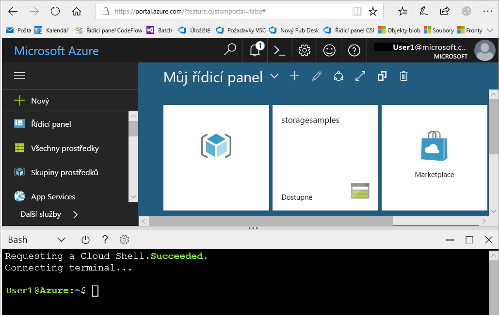
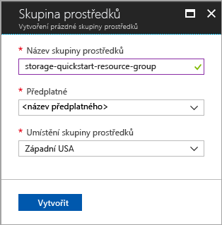
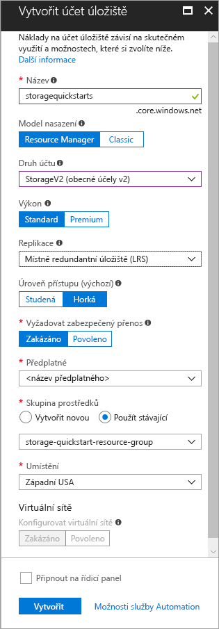

# <a name="create-a-storage-account"></a>vytvořit účet úložiště

Účet úložiště Azure Storage poskytuje jedinečný obor názvů v cloudu pro ukládání datových objektů ve službě Azure Storage a přístup k nim. Účet úložiště obsahuje všechny objekty blob, soubory, fronty, tabulky a disky, které pod tímto účtem vytvoříte. 

Pokud chcete začít pracovat se službou Azure Storage, musíte nejdřív vytvořit účet úložiště. Účet Azure Storage si můžete vytvořit pomocí [webu Azure Portal](https://portal.azure.com/), [Azure PowerShellu](https://docs.microsoft.com/powershell/azure/overview) nebo [rozhraní příkazového řádku Azure](https://docs.microsoft.com/cli/azure/overview?view=azure-cli-latest). Tento rychlý start ukazuje, jak tyto jednotlivé možnosti využít k vytvoření nového účtu úložiště. 


## <a name="prerequisites"></a>Požadavky

Pokud ještě nemáte předplatné Azure, vytvořte si [bezplatný účet](https://azure.microsoft.com/free/) před tím, než začnete.

# <a name="portaltabportal"></a>[Azure Portal](#tab/portal)

Žádné.

# <a name="powershelltabpowershell"></a>[PowerShell](#tab/powershell)

Tento rychlý start vyžaduje modul Azure PowerShell verze 3.6 nebo novější. Aktuální verzi zjistíte spuštěním `Get-Module -ListAvailable AzureRM`. Pokud potřebujete instalaci nebo upgrade, přečtěte si téma [Instalace modulu Azure PowerShell](/powershell/azure/install-azurerm-ps).

# <a name="azure-clitabazure-cli"></a>[Azure CLI](#tab/azure-cli)

Pokud se chcete přihlásit do Azure s spouštět příkazy rozhraní příkazového řádku Azure CLI, máte dvě možnosti:

- Příkazy rozhraní příkazového řádku můžete spouštět v prostředí Azure Portal, v Azure Cloud Shellu. 
- Můžete nainstalovat rozhraní příkazového řádku a příkazy rozhraní příkazového řádku spouštět místně.  

### <a name="use-azure-cloud-shell"></a>Použití Azure Cloud Shellu

Azure Cloud Shell je volně dostupné prostředí Bash, které můžete spustit přímo z webu Azure Portal. Má předinstalované rozhraní Azure CLI, které je nakonfigurované pro použití s vaším účtem. Klikněte na tlačítko **Cloud Shell** v nabídce v pravé horní části webu Azure Portal:

[](https://portal.azure.com)

Toto tlačítko spustí interaktivní prostředí, které můžete použít k provedení kroků v tomto rychlém startu:

[](https://portal.azure.com)

### <a name="install-the-cli-locally"></a>Místní instalace rozhraní příkazového řádku

Rozhraní příkazového řádku Azure můžete také nainstalovat a používat místně. Tento rychlý start vyžaduje použití Azure CLI verze 2.0.4 nebo novější. Verzi zjistíte spuštěním příkazu `az --version`. Pokud potřebujete instalaci nebo upgrade, přečtěte si téma [Instalace Azure CLI 2.0](/cli/azure/install-azure-cli). 

---

## <a name="log-in-to-azure"></a>Přihlášení k Azure

# <a name="portaltabportal"></a>[Azure Portal](#tab/portal)

Přihlaste se k portálu [Azure Portal](https://portal.azure.com).

# <a name="powershelltabpowershell"></a>[PowerShell](#tab/powershell)

Přihlaste se k předplatnému Azure pomocí příkazu `Login-AzureRmAccount` a při ověřování postupujte podle pokynů na obrazovce.

```powershell
Login-AzureRmAccount
```

# <a name="azure-clitabazure-cli"></a>[Azure CLI](#tab/azure-cli)

Pokud chcete spustit Azure Cloud Shell, přihlaste se k webu [Azure Portal](https://portal.azure.com).

Pro přihlášení k místní instalaci rozhraní příkazového řádku spusťte přihlašovací příkaz:

```cli
az login
```

---

## <a name="create-a-resource-group"></a>Vytvoření skupiny prostředků

Skupina prostředků Azure je logický kontejner, ve kterém se nasazují a spravují prostředky Azure. Další informace o skupinách prostředků najdete v článku [Přehled Azure Resource Manageru](../../azure-resource-manager/resource-group-overview.md).

# <a name="portaltabportal"></a>[Azure Portal](#tab/portal)

Při vytváření skupiny prostředků na webu Azure Portal použijte tento postup:

1. Na webu Azure Portal rozbalením nabídky na levé straně otevřete nabídku služeb a zvolte **Skupiny prostředků**.
2. Kliknutím na tlačítko **Přidat** přidáte novou skupinu prostředků.
3. Zadejte název nové skupiny prostředků.
4. Vyberte předplatné, ve kterém chcete novou skupinu prostředků vytvořit.
5. Vyberte umístění pro tuto skupinu prostředků.
6. Klikněte na tlačítko **Vytvořit**.  



# <a name="powershelltabpowershell"></a>[PowerShell](#tab/powershell)

Pokud chcete vytvořit novou skupinu prostředků pomocí PowerShellu, použijte příkaz [New-AzureRmResourceGroup](/powershell/module/azurerm.resources/new-azurermresourcegroup): 

```powershell
# put resource group in a variable so you can use the same group name going forward,
# without hardcoding it repeatedly
$resourceGroup = "storage-quickstart-resource-group"
New-AzureRmResourceGroup -Name $resourceGroup -Location $location 
```

Pokud si nejste jisti, jakou oblast máte zadat v parametru `-Location`, můžete pomocí příkazu [Get-AzureRmLocation](/powershell/module/azurerm.resources/get-azurermlocation) načíst seznam podporovaných oblastí pro vaše předplatné:

```powershell
Get-AzureRmLocation | select Location 
$location = "westus"
```

# <a name="azure-clitabazure-cli"></a>[Azure CLI](#tab/azure-cli)

Pokud chcete vytvořit novou skupinu prostředků pomocí rozhraní příkazového řádku Azure, použijte příkaz [az group create](/cli/azure/group#az_group_create). 

```azurecli-interactive
az group create \
    --name storage-quickstart-resource-group \
    --location westus
```

Pokud si nejste jisti, jakou oblast máte zadat v parametru `--location`, můžete pomocí příkazu [az account list-locations](/cli/azure/account#az_account_list) načíst seznam podporovaných oblastí pro vaše předplatné.

```azurecli-interactive
az account list-locations \
    --query "[].{Region:name}" \
    --out table
```

---

## <a name="create-a-general-purpose-storage-account"></a>Vytvoření účtu úložiště pro obecné účely

Účet úložiště pro obecné účely poskytuje přístup ke všem službám Azure Storage: objektům blob, souborům, frontám a tabulkám. Účet úložiště pro obecné účely je možné vytvořit s úrovní Standard nebo Premium. Příklady v tomto článku ukazují, jak vytvořit účet úložiště pro obecné účely v úrovni Standard (výchozí).

Úložiště Azure nabízí dva typy účtů úložiště pro obecné účely:

- Účty úložiště pro obecné účely verze 2 
- Účty úložiště pro obecné účely verze 1 

> [!NOTE]
> Doporučuje se vytvářet nové účty úložiště jako **účty pro obecné účely verze 2**, abyste mohli využívat novější funkce, které jsou pro tyto účty k dispozici.  

Další informace o typech účtů úložiště najdete v článku [Možnosti účtu Azure Storage](storage-account-options.md).

Při pojmenování účtu úložiště mějte na paměti tato pravidla:

- Názvy účtů úložiště musí mít od 3 do 24 znaků a můžou obsahovat jenom číslice a malá písmena.
- Váš název účtu úložiště musí být jedinečný v rámci Azure. Žádné dva účty úložiště nemohou mít stejný název.

# <a name="portaltabportal"></a>[Azure Portal](#tab/portal)

Pokud chcete vytvořit účet úložiště pro obecné účely verze 2 na webu Azure Portal, postupujte takto:

1. Na webu Azure Portal rozbalením nabídky na levé straně otevřete nabídku služeb a zvolte **Všechny služby**. Potom přejděte dolů do části **Úložiště** a zvolte **Účty úložiště**. V okně **Účty úložiště**, které se zobrazí, zvolte **Přidat**.
2. Zadejte název účtu úložiště.
3. V poli **Druh účtu** nastavte hodnotu **StorageV2 (v2 pro obecné účely)**.
4. V poli **Replikace** nechte nastavenou hodnotu **Místně redundantní úložiště (LRS)**. Alternativně můžete zvolit **Zónově redundantní úložiště (ZRS Preview)**, **Geograficky redundantní úložiště (GRS)** nebo **Geograficky redundantní úložiště s přístupem pro čtení (RA-GRS)**.
5. V následujících polích ponechte výchozí nastavení: **Model nasazení**, **Výkon** a **Vyžadovat zabezpečený přenos**.
6. Vyberte předplatné, ve kterém chcete vytvořit účet úložiště.
7. V části **Skupina prostředků** vyberte **Použít stávající** a potom zvolte skupinu prostředků, kterou jste vytvořili v předchozí části.
8. Vyberte umístění pro váš nový účet úložiště.
9. Vytvořte účet úložiště kliknutím na **Vytvořit**.      



# <a name="powershelltabpowershell"></a>[PowerShell](#tab/powershell)

Pokud chcete vytvořit účet úložiště pro obecné účely verze 2 pomocí PowerShellu s využitím místně redundantního úložiště (LRS), použijte příkaz [New-AzureRmStorageAccount](/powershell/module/azurerm.storage/New-AzureRmStorageAccount): 

```powershell
New-AzureRmStorageAccount -ResourceGroupName $resourceGroup `
  -Name "storagequickstart" `
  -Location $location `
  -SkuName Standard_LRS `
  -Kind StorageV2 
```

Pokud chcete vytvořit účet úložiště pro obecné účely verze 2 s využitím zónově redundantního úložiště (ZRS Preview), geograficky redundantního úložiště (GRS) nebo geograficky redundantního úložiště s přístupem pro čtení (RA-GRS), nahraďte v následující tabulce parametr **SkuName** požadovanou hodnotou. 

|Možnost replikace  |Parametr SkuName  |
|---------|---------|
|Místně redundantní úložiště (LRS)     |Standard_LRS         |
|Zónově redundantní úložiště (ZRS)     |Standard_ZRS         |
|Geograficky redundantní úložiště (GRS)     |Standard_GRS         |
|Geograficky redundantní úložiště s přístupem pro čtení (RA-GRS)     |Standard_RAGRS         |

# <a name="azure-clitabazure-cli"></a>[Azure CLI](#tab/azure-cli)

Pokud chcete vytvořit účet úložiště pro obecné účely verze 2 s využitím rozhraní příkazového řádku Azure a místně redundantního úložiště, použijte příkaz [az storage account create](/cli/azure/storage/account#az_storage_account_create).

```azurecli-interactive
az storage account create \
    --name storagequickstart \
    --resource-group storage-quickstart-resource-group \
    --location westus \
    --sku Standard_LRS \
    --kind StorageV2
```

Pokud chcete vytvořit účet úložiště pro obecné účely verze 2 s využitím zónově redundantního úložiště (ZRS Preview), geograficky redundantního úložiště (GRS) nebo geograficky redundantního úložiště s přístupem pro čtení (RA-GRS), nahraďte v následující tabulce parametr **sku** požadovanou hodnotou. 

|Možnost replikace  |Parametr sku  |
|---------|---------|
|Místně redundantní úložiště (LRS)     |Standard_LRS         |
|Zónově redundantní úložiště (ZRS)     |Standard_ZRS         |
|Geograficky redundantní úložiště (GRS)     |Standard_GRS         |
|Geograficky redundantní úložiště s přístupem pro čtení (RA-GRS)     |Standard_RAGRS         |

---

> [!NOTE]
> [Zónově redundantní úložiště](https://azure.microsoft.com/blog/announcing-public-preview-of-azure-zone-redundant-storage/preview/) je aktuálně ve verzi preview a je k dispozici pouze v následujících umístěních:
>    - USA – východ 2
>    - USA – střed
>    - Francie – střed (Tato oblast je aktuálně ve verzi preview. Pokud chcete požádat o přístup, najdete informace v článku o tom, že [ve Francii je nyní k dispozici Microsoft Azure ve verzi preview se zónami dostupnosti Azure](https://azure.microsoft.com/blog/microsoft-azure-preview-with-azure-availability-zones-now-open-in-france).)
    
Další informace o různých typech replikace, které jsou k dispozici, najdete v článku [Možnosti replikace úložiště](storage-redundancy.md).

## <a name="clean-up-resources"></a>Vyčištění prostředků

Pokud chcete vyčistit prostředky vytvořené v tomto rychlém startu, stačí jednoduše odstranit skupinu prostředků. Odstraněním skupiny prostředků odstraníte také přidružený účet úložiště a všechny další prostředky, které jsou k příslušné skupině prostředků přidružené.

# <a name="portaltabportal"></a>[Azure Portal](#tab/portal)

Pokud chcete odebrat skupinu prostředků s využitím webu Azure Portal:

1. Na webu Azure Portal rozbalením nabídky na levé straně otevřete nabídku služeb a zvolte **Skupiny prostředků**. Zobrazí se seznam skupin prostředků.
2. Vyhledejte skupinu prostředků, kterou chcete odstranit, a klikněte pravým tlačítkem myši na tlačítko **Další** (**...** ) na pravé straně seznamu.
3. Vyberte **Odstranit skupinu prostředků** a potvrďte tuto akci.

# <a name="powershelltabpowershell"></a>[PowerShell](#tab/powershell)

Pokud chcete odebrat skupinu prostředků a její přidružené prostředky, včetně nového účtu úložiště, použijte příkaz [Remove-AzureRmResourceGroup](/powershell/module/azurerm.resources/remove-azurermresourcegroup): 

```powershell
Remove-AzureRmResourceGroup -Name $resourceGroup
```

# <a name="azure-clitabazure-cli"></a>[Azure CLI](#tab/azure-cli)

Pokud chcete odebrat skupinu prostředků a její přidružené prostředky, včetně nového účtu úložiště, použijte příkaz [az group delete](/cli/azure/group#az_group_delete).

```azurecli-interactive
az group delete --name myResourceGroup
```

---

## <a name="next-steps"></a>Další kroky

V tomto rychlém startu jste vytvořili účet úložiště úrovně Standard pro obecné účely. Pokud chcete zjistit, jak v účtu úložiště nahrávat a stahovat objekty blob, pokračujte k rychlému startu pro úložiště objektů blob.

# <a name="portaltabportal"></a>[Azure Portal](#tab/portal)

> [!div class="nextstepaction"]
> [Přenos objektů do a z úložiště objektů blob v Azure pomocí webu Azure Portal](../blobs/storage-quickstart-blobs-portal.md)

# <a name="powershelltabpowershell"></a>[PowerShell](#tab/powershell)

> [!div class="nextstepaction"]
> [Přenos objektů do a z úložiště objektů blob v Azure pomocí PowerShellu](../blobs/storage-quickstart-blobs-powershell.md)

# <a name="azure-clitabazure-cli"></a>[Azure CLI](#tab/azure-cli)

> [!div class="nextstepaction"]
> [Přenos objektů do a z úložiště objektů blob v Azure pomocí Azure CLI](../blobs/storage-quickstart-blobs-cli.md)

---
