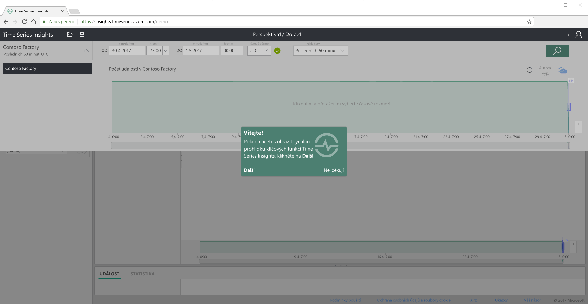
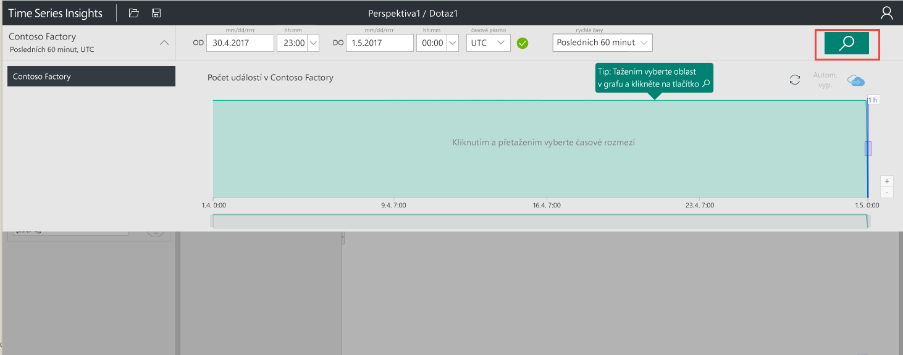
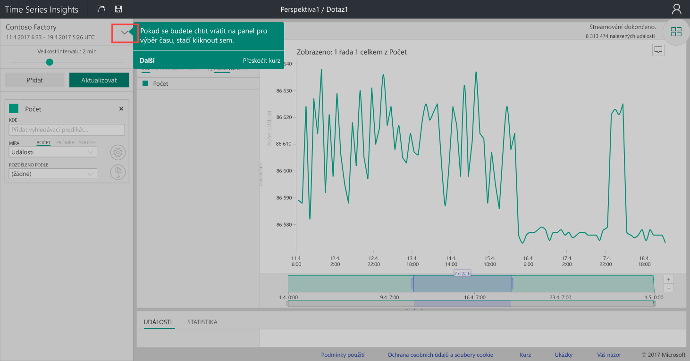
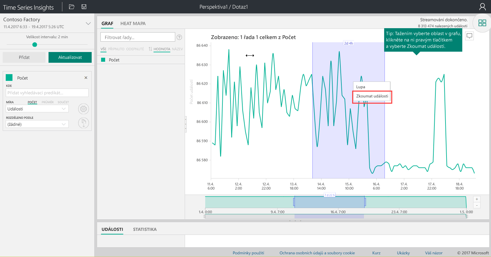
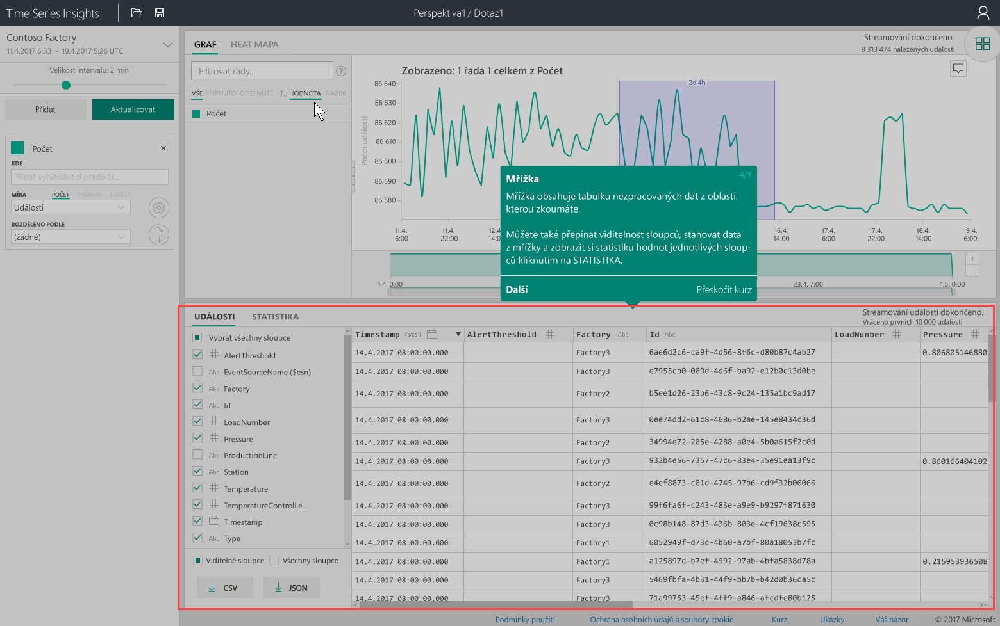
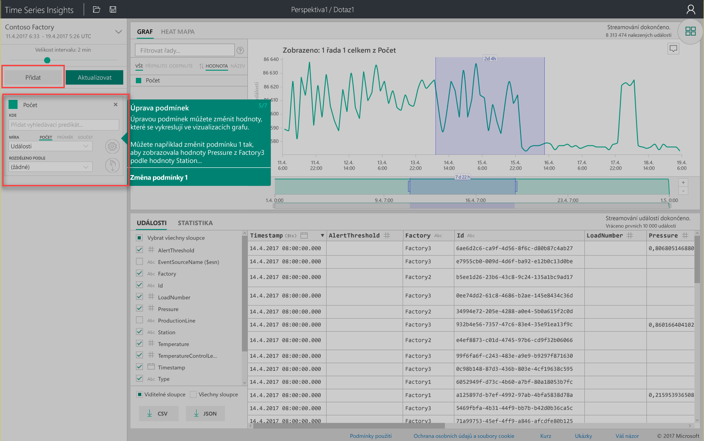
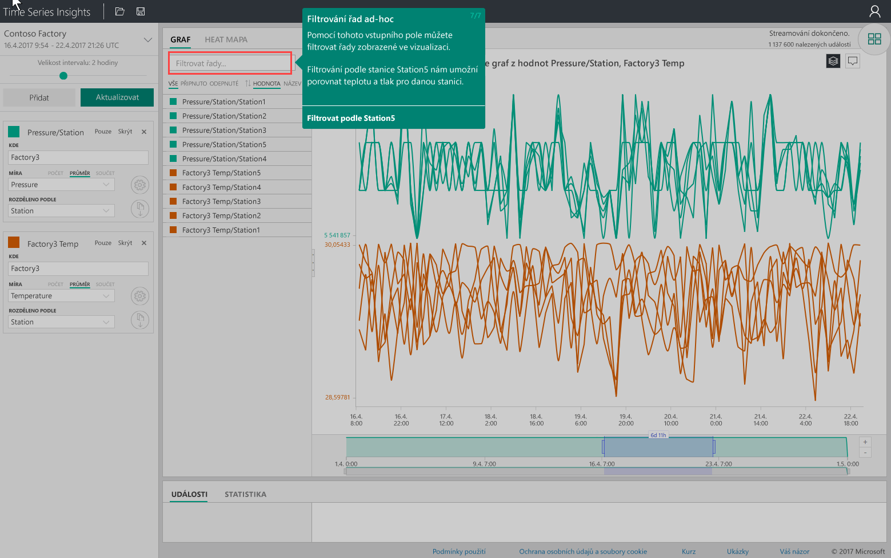

# Rychlý start: Prozkoumání služby Azure Time Series Insights
V tomto rychlém startu se dozvíte, jak začít s průzkumníkem služby Azure Time Series Insights v bezplatném ukázkovém prostředí. Zjistíte, jak pomocí webového prohlížeče vizualizovat velké objemy dat IoT a prohlédnete si klíčové funkce průzkumníka služby Time Series Insights. 

Azure Time Series Insights je plně spravovaná služba pro analýzy, ukládání a vizualizace, která usnadňuje zkoumání a analýzy miliard událostí IoT současně. Poskytuje globální přehled o datech a umožňuje rychle ověřit vaše řešení IoT a vyhnout se nákladným prostojům důležitých zařízení, protože pomáhá odhalovat skryté trendy, detekovat anomálie a provádět analýzy původních příčin téměř v reálném čase.  Pokud vytváříte aplikaci, která potřebuje ukládat nebo dotazovat data časových řad, můžete při vývoji využít rozhraní REST API služby Time Series Insights.

Pokud ještě nemáte předplatné Azure, vytvořte si [bezplatný účet Azure](https://azure.microsoft.com/free/?ref=microsoft.com&utm_source=microsoft.com&utm_medium=docs&utm_campaign=visualstudio) před tím, než začnete.

## Průzkumník služby Time Series Insights v ukázkovém prostředí

1. V prohlížeči přejděte na adresu [https://insights.timeseries.azure.com/demo](https://insights.timeseries.azure.com/demo). 

2. Pokud k tomu budete vyzváni, přihlaste se do průzkumníka služby Time Series Insights pomocí přihlašovacích údajů svého účtu Azure. 
 
3. Zobrazí se stránka s krátkou prohlídkou služby Time Series Insights. Zahajte rychlou prohlídku kliknutím na **Další**.

   

4. Zobrazí se **Panel výběru času**. Pomocí tohoto panelu vyberte časový rámec, který chcete vizualizovat.

   

5. Klikněte na oblast a tažením ji přesuňte do grafu, pak klikněte na tlačítko **Vyhledat**.
 
    

   Time Series Insights zobrazí vizualizaci grafu pro zadaný časový rámec. Ve spojnicovém grafu můžete provádět různé akce, jako jsou filtrování, připínání, řazení a vrstvení. 

   Pokud se chcete vrátit na **Panel výběru času**, klikněte na šipku dolů, jak je znázorněno níže:

   

6. Na **Panelu výrazů** klikněte na **Přidat** a přidejte nový hledaný výraz.

   

7. V grafu můžete vybrat oblast, kliknout na ni pravým tlačítkem a vybrat **Prozkoumat události**.
 
   

   Zobrazí se mřížka nezpracovaných dat ze zkoumané oblasti:

   

8. Upravte výrazy, aby se změnily hodnoty v grafu, a přidejte další výraz, aby se provedla vzájemná korelace různých typů hodnot:

   

9. Do pole **Filtrovat řady...** zadejte podmínky filtru a proveďte ad hoc filtrování řad. Pro účely tohoto rychlého startu zadejte **Station5**, aby se provedla vzájemná korelace teploty a tlaku pro příslušnou stanici.
 
   

Po dokončení tohoto rychlého startu můžete experimentovat s ukázkovou sadou dat a vytvářet různé vizualizace. 

### Další kroky
Jste připraveni vytvořit vlastní prostředí Time Series Insights:
> [!div class="nextstepaction"]
> [Plánování prostředí Time Series Insights](time-series-insights-environment-planning.md)
