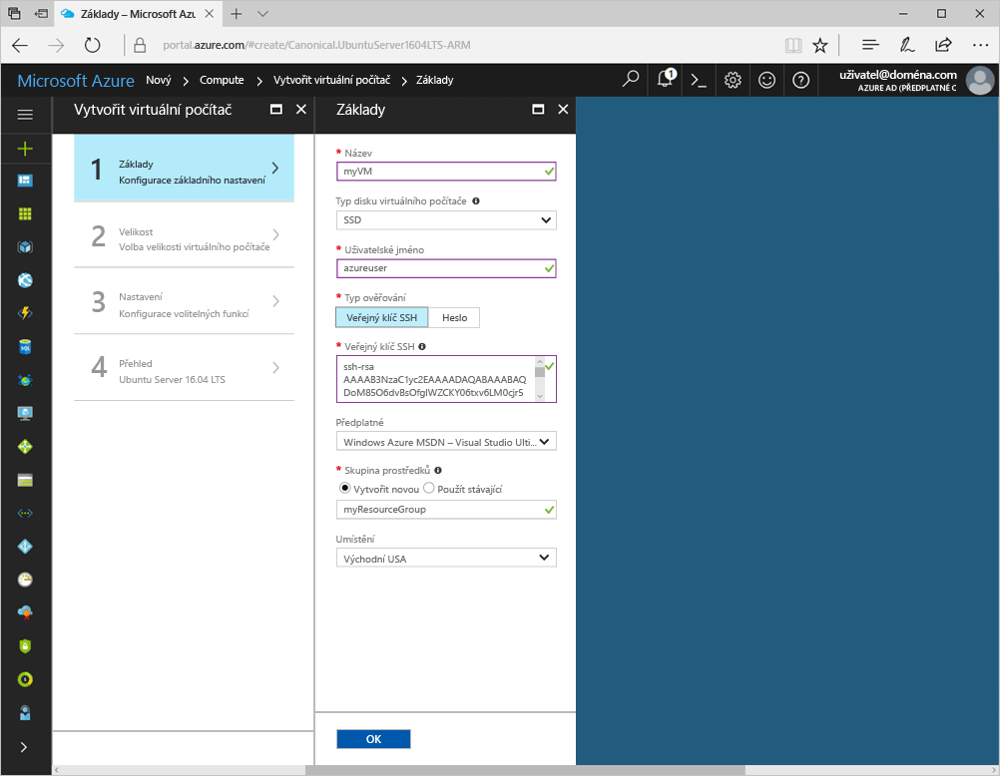
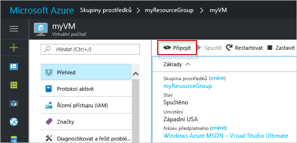

# <a name="create-a-linux-virtual-machine-with-the-azure-portal"></a>Vytvoření virtuálního počítače s Linuxem pomocí webu Azure Portal

Virtuální počítače Azure je možné vytvářet na webu Azure Portal. Tato metoda poskytuje uživatelské rozhraní v prohlížeči, pomocí kterého můžete vytvářet a konfigurovat virtuální počítače a všechny související prostředky. Tento Rychlý start prochází jednotlivé kroky k vytvoření virtuálního počítače pomocí webu Azure Portal. 

Pokud ještě nemáte předplatné Azure, vytvořte si [bezplatný účet](https://azure.microsoft.com/free/) před tím, než začnete.

## <a name="create-ssh-key-pair"></a>Vytvoření páru klíčů SSH

K dokončení tohoto rychlého startu potřebujete pár klíčů SSH. Pokud máte existující pár klíčů SSH, můžete tento krok přeskočit. Pokud používáte počítač s Windows, postupujte podle pokynů uvedených [tady](ssh-from-windows.md). 

Z prostředí Bash spusťte tento příkaz a postupujte podle pokynů na obrazovce. Výstup příkazu zahrnuje název souboru veřejného klíče. Obsah tohoto souboru budete potřebovat při vytváření virtuálního počítače.

```bash
ssh-keygen -t rsa -b 2048
```

## <a name="log-in-to-azure"></a>Přihlaste se k Azure. 

Přihlaste se k webu Azure Portal na adrese http://portal.azure.com.

## <a name="create-virtual-machine"></a>Vytvoření virtuálního počítače

1. Klikněte na tlačítko **Nový** v levém horním rohu webu Azure Portal.

2. V okně **Nový** vyberte **Compute**, v okně **Compute** vyberte **Ubuntu Server 16.04 LTS** a potom klikněte na tlačítko **Vytvořit**.

3. Vyplňte formulář **Základní informace** o virtuálním počítači. Jako **Typ ověřování** vyberte **SSH**. Při vkládání **veřejného klíče SSH** nezapomeňte odebrat počáteční a koncové prázdné znaky. V části **Skupina prostředků** vytvořte novou. Skupina prostředků je logický kontejner, ve kterém se vytváří a hromadně spravují prostředky Azure. Jakmile budete hotovi, klikněte na **OK**.

      

4. Zvolte velikost virtuálního počítače a klikněte na **Vybrat**. 

    

5. V okně Nastavení v části **Použít spravované disky** vyberte **Ano**, pro zbytek nastavení ponechte výchozí hodnoty a klikněte na **OK**.

6. Na stránce Souhrn kliknutím na **Ok** spusťte nasazení virtuálního počítače.

7. Chcete-li monitorovat stav nasazení, klikněte na virtuální počítač. Virtuální počítač najdete na webu Azure Portal na řídicím panelu nebo výběrem možnosti **Virtual Machines** z nabídky vlevo. Po vytvoření virtuálního počítače se stav se změní z **Nasazování** na **Spuštěno**.


## <a name="open-port-80-for-web-traffic"></a>Otevření portu 80 pro webový provoz 

Ve výchozím nastavení jsou na virtuální počítače s Linuxem, které jsou nasazené v Azure, povolená pouze připojení SSH. Pokud bude tento virtuální počítač webovým serverem, budete muset otevřít port 80 pro webový provoz. Tento krok vás provede procesem vytvoření pravidla skupiny zabezpečení sítě (NSG), aby byla možná příchozí připojení na portu 80.

1. V okně pro virtuální počítač v části **Základy** klikněte na název **skupiny prostředků**.
2. V okně pro skupinu prostředků klikněte v seznamu prostředků na **Skupina zabezpečení sítě**. Název skupiny NSG musí být název virtuálního počítače s příponou -nsg.
3. Klikněte na záhlaví **Příchozí pravidlo zabezpečení** a otevřete seznam příchozích pravidel. V seznamu byste už měli vidět pravidlo pro protokol RDP.
4. Klikněte na **+ Přidat** a otevřete okno **Přidat příchozí pravidlo zabezpečení**.
5. Do pole **Název** zadejte **nginx** a zkontrolujte, že **Rozsah portů** je nastavený na 80 a **Akce** je nastavená na **Povolit**, a pak klikněte na **OK**.


## <a name="connect-to-virtual-machine"></a>Připojení k virtuálnímu počítači

Po dokončení nasazení vytvořte připojení SSH k virtuálnímu počítači.

1. Klikněte na tlačítko **Vytvořit** v okně virtuálního počítače. Tlačítko Připojit zobrazí připojovací řetězec SSH, pomocí kterého se můžete připojit k virtuálnímu počítači.

     

2. Spuštěním následujícího příkazu vytvořte relaci SSH. Nahraďte připojovací řetězec tím, který jste zkopírovali z webu Azure Portal.

```bash 
ssh <replace with IP address>
```

## <a name="install-nginx"></a>Instalace serveru NGINX

Pomocí následujícího skriptu bash provedete aktualizaci zdrojů balíčku a nainstalujete nejnovější balíček NGINX. 

```bash 
#!/bin/bash

# update package source
apt-get -y update

# install NGINX
apt-get -y install nginx
```

## <a name="view-the-ngix-welcome-page"></a>Zobrazení úvodní stránky serveru NGINX

S nainstalovaným serverem NGINX na virtuálním počítači a nyní otevřeným portem 80 z internetu můžete použít libovolný webový prohlížeč a zobrazit výchozí úvodní stránku serveru NGINX. Nezapomeňte pro návštěvu výchozí stránky použít adresu `publicIpAddress` popsanou výše. 

 
## <a name="delete-virtual-machine"></a>Odstranění virtuálního počítače

Pokud už je nepotřebujete, odstraňte skupinu prostředků, virtuální počítač a všechny související prostředky. Provedete to tak, že v okně virtuálního počítače vyberete skupinu prostředků a kliknete na **Odstranit**.

## <a name="next-steps"></a>Další kroky

[Kurz vytvoření virtuálního počítače s vysokou dostupností](create-cli-complete.md?toc=%2fazure%2fvirtual-machines%2flinux%2ftoc.json)

[Prozkoumejte ukázky nasazení virtuálního počítače pomocí rozhraní příkazového řádku](../windows/cli-samples.md?toc=%2fazure%2fvirtual-machines%2flinux%2ftoc.json)

