<properties
    pageTitle="Vytvoření vašeho prvního virtuálního počítače s Windows | Microsoft Azure"
    description="Zjistěte, jak si vytvořit svůj první virtuální počítač s Windows pomocí Portálu Azure."
    keywords="virtuální počítač s Windows,vytvoření virtuálního počítače,virtuální počítač,nastavení virtuálního počítače"
    services="virtual-machines-windows"
    documentationCenter=""
    authors="cynthn"
    manager="timlt"
    editor=""
    tags="azure-resource-manager"/>
<tags
    ms.service="virtual-machines-windows"
    ms.workload="infrastructure-services"
    ms.tgt_pltfrm="vm-windows"
    ms.devlang="na"
    ms.topic="hero-article"
    ms.date="06/07/2016"
    ms.author="cynthn"/>

# Vytvoření vašeho prvního virtuálního počítače s Windows na Portálu Azure

Tento kurz vám ukáže, jak si snadno během několika málo minut vytvořit virtuální počítač s Windows pomocí Portálu Azure.  

Pokud nemáte předplatné Azure, můžete si [bezplatně vytvořit účet](https://azure.microsoft.com/free/) během několika minut.

Tady je [video s návodem](https://channel9.msdn.com/Blogs/Azure-Documentation-Shorts/Create-A-Virtual-Machine-Running-Windows-In-The-Azure-Preview-Portal) pro tento kurz. 

## Volba image virtuálního počítače z Marketplace

Jako příklad používáme image systému Windows Server 2012 R2 Datacenter, je to ale pouze jedna z mnoha imagí, které Azure nabízí. Volba image závisí na tom, jaké máte předplatné. [Předplatitelé MSDN](https://azure.microsoft.com/pricing/member-offers/msdn-benefits-details/?WT.mc_id=A261C142F) můžou mít například k dispozici image desktopových verzí operačního systému.

1. Přihlaste se k [portálu Azure](https://portal.azure.com).

2. V nabídce centra klikněte na **Nový** > **Virtuální počítače** > **Windows Server 2012 R2 Datacenter**.

    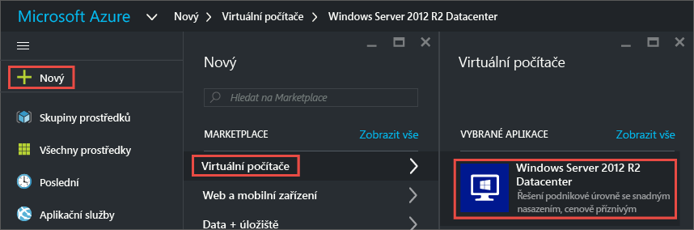

3. Na stránce **Windows Server 2012 R2 Datacenter** v části **Vybrat model nasazení** ověřte, že je vybraný **Resource Manager**. Klikněte na možnost **Vytvořit**.

    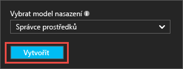

## Vytvoření virtuálního počítače s Windows

Po výběru image můžete pro většinu položek konfigurace použít výchozí nastavení Azure a rychle vytvořit virtuální počítač.

1. V okně **Základy** zadejte **název** pro virtuální počítač. Název musí mít 1 až 15 znaků a nesmí obsahovat speciální znaky.

2. Zadejte **uživatelské jméno** a silné **heslo**, které se použijí k vytvoření místního účtu ve virtuálním počítači. Místní účet se používá k přihlášení k virtuálnímu počítači a jeho správě. 

    Heslo musí být 12 až 123 znaků dlouhé a musí obsahovat minimálně jedno malé písmeno, jedno velké písmeno, jednu číslici a jeden speciální znak. 

3. Vyberte existující [skupinu prostředků](../resource-group-overview.md#resource-groups) nebo zadejte název nové skupiny prostředků. Zadejte **umístění** datového centra Azure, například **Západní USA**. 

4. Až to budete mít, přejděte kliknutím na **OK** k další části. 

    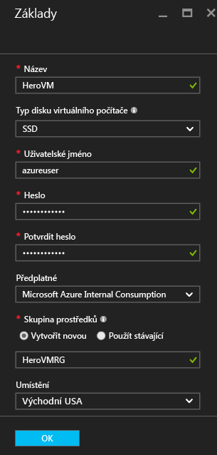

    
5. Zvolte [velikost](virtual-machines-windows-sizes.md) virtuálního počítače a potom pokračujte kliknutím na **Vybrat**. 

    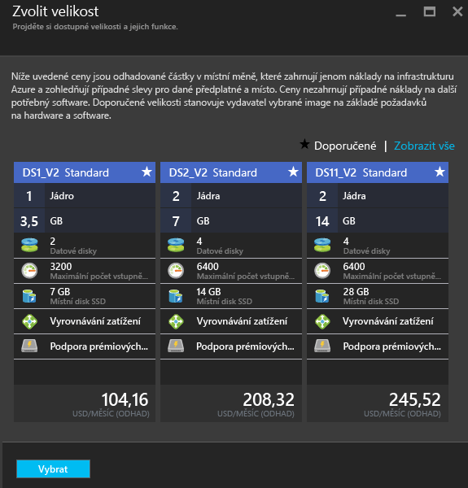

6. V okně **Nastavení** můžete změnit možnosti úložiště a sítí. Pro první virtuální počítač můžete obvykle přijmout výchozí nastavení. Pokud jste vybrali velikost virtuálního počítače, který to podporuje, můžete výběrem možnosti **Premium (SSD)** v části **Typ disku** vyzkoušet Storage úrovně Premium. Po dokončení změn klikněte na **OK**.

    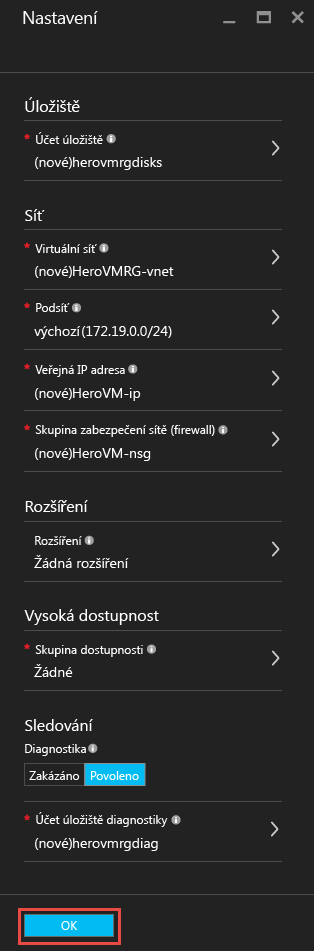

7. Klikněte na **Souhrn** a zkontrolujte zvolené volby. Až to budete mít, klikněte na **OK**.

    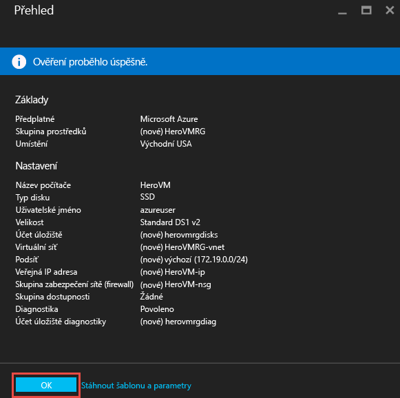

8. Zatímco bude Azure vytvářet virtuální počítač, můžete sledovat průběh v nabídce centra v části **Virtuální počítače**. 

## Připojení k virtuálnímu počítači a přihlášení

1.  V nabídce centra klikněte na **Virtuální počítače**.

2.  Ze seznamu vyberte virtuální počítač.

3. V okně pro virtuální počítač klikněte na **Připojit**. Tím se vytvoří a stáhne soubor .rdp (Remote Desktop Protocol), který představuje zástupce připojení k vašemu počítači. Můžete si ho uložit na plochu, abyste k němu měli snadno přístup. **Otevřením** tohoto souboru se připojíte ke svému virtuálnímu počítači.

    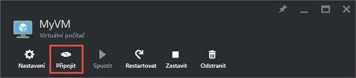

4. Zobrazí se upozornění, že soubor RDP je od neznámého vydavatele. To je normální. Pokračujte kliknutím na **Připojit** v okně Připojení ke vzdálené ploše.

    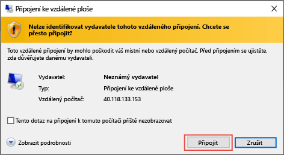

5. V okně zabezpečení systému Windows zadejte uživatelské jméno a heslo pro místní účet, který jste vytvořili při vytváření virtuálního počítače. Zadejte uživatelské jméno v této podobě: *název_virtuálního_počítače*&#92;*uživatelské_jméno* a pak klikněte na **OK**.

    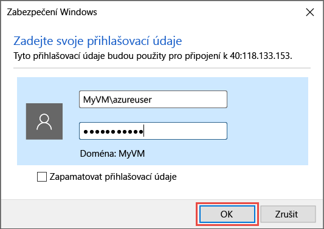
    
6.  Zobrazí se upozornění, že není možné ověřit certifikát. To je normální. Kliknutím na **Ano** ověřte identitu virtuálního počítače a dokončete přihlášení.

    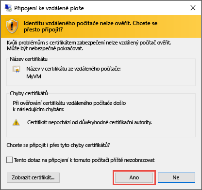

Pokud budete mít s připojením problémy, projděte si téma [Poradce při potížích s připojením k virtuálnímu počítači s Windows v Azure pomocí Vzdálené plochy](virtual-machines-windows-troubleshoot-rdp-connection.md).

Teď můžete s virtuálním počítačem pracovat stejně jako s jakýmkoli jiným serverem.

## Zastavení virtuálního počítače

Pokud virtuální počítač nepoužíváte, je vhodné ho zastavit, aby vám zbytečně nenabíhaly poplatky. Stačí kliknout na tlačítko **Zastavit** a potom kliknout na **Ano**.

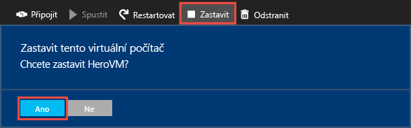
    
Až ho budete chtít zase použít, stačí kliknout na tlačítko **Spustit **.

## Další kroky

* Také můžete experimentovat s [připojením datového disku](virtual-machines-windows-attach-disk-portal.md) k vašemu virtuálnímu počítači. Pomocí datových disků si můžete rozšířit úložiště pro virtuální počítač.

* Můžete také [vytvořit virtuální počítač s Windows pomocí PowerShellu](virtual-machines-windows-ps-create.md) nebo [vytvořit virtuální počítač s Linuxem](virtual-machines-linux-quick-create-cli.md) pomocí Azure CLI.

<!--HONumber=Aug16_HO4-->

