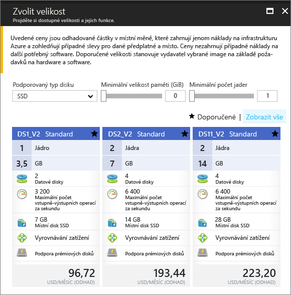

# <a name="create-a-windows-virtual-machine-in-an-availability-zone-with-the-azure-portal"></a>Vytvoření virtuálního počítače s Windows v zóně dostupnosti pomocí portálu Azure

Tento článek obsahuje kroky prostřednictvím portálu Azure k vytvoření virtuálního počítače v zóně Azure dostupnosti. [Zóna dostupnosti](../../availability-zones/az-overview.md) je fyzicky oddělená zóna v oblasti Azure. Zóny dostupnosti se používají k ochraně aplikací a dat před málo pravděpodobným selháním nebo ztrátou celého datového centra.

[!INCLUDE [availability-zones-preview-statement.md](../../../includes/availability-zones-preview-statement.md)]


## <a name="log-in-to-azure"></a>Přihlaste se k Azure. 

Přihlaste se k portálu Azure na https://portal.azure.com.

## <a name="create-virtual-machine"></a>Vytvoření virtuálního počítače

1. Klikněte na tlačítko **Nový** v levém horním rohu portálu Azure Portal.

2. Vyberte **Compute** a potom vyberte **Windows Server 2016 Datacenter**. 

3. Zadejte informace o virtuálním počítači. Uživatelské jméno a heslo, které tady zadáte, se používá k přihlášení k virtuálnímu počítači. Jakmile budete hotovi, klikněte na **OK**.

    

4. Vyberte velikost virtuálního počítače. Pokud chcete zobrazit další velikosti, vyberte **Zobrazit všechny** nebo změňte filtr **Podporovaný typ disku**. Vezměte v potaz, vyberte jednu z velikosti podporované ve verzi preview zón dostupnosti, jako například *DS1_v2 standardní*. 

      

5. V části **nastavení** > **vysokou dostupnost**, vyberte jednu z číslem zóny z **dostupnost zóny** rozevíracího seznamu, ponechejte zbývající výchozí hodnoty, a Klikněte na tlačítko **OK**.

    

6. Na stránce Souhrn klikněte na tlačítko **nákupu** ke spuštění nasazení virtuálního počítače.

7. Virtuální počítač se připne na řídicí panel webu Azure Portal. Po dokončení nasazení se automaticky otevře souhrn virtuálního počítače.


## <a name="zone-for-ip-address-and-managed-disk"></a>Zóna pro IP adresu a spravovaný disk

Po nasazení virtuálního počítače v zóně dostupnosti IP adres a spravovaných disků na prostředky nasazených ve stejném pásmu dostupnosti. Můžete potvrdit nastavení zóny pomocí Azure PowerShell. Pokud potřebujete instalaci nebo upgrade, přečtěte si téma [Instalace modulu Azure PowerShell](/powershell/azure/install-azurerm-ps).

Následující příklady získat informace o prostředcích ve skupině prostředků s názvem *myResourceGroup*. Nahraďte název skupiny prostředků, které jste použili k vytvoření virtuálního počítače.

Najít zónu veřejné IP adresy s [Get-AzureRmPublicIpAddress](/en-us/powershell/module/azurerm.network/get-azurermpublicipaddress):

```powershell
Get-AzureRmPublicIpAddress -ResourceGroupName myResourceGroup
```
`Zones` Nastavení ve výstupu ukazuje, že veřejná IP adresa je v zóně dostupnosti jako virtuální počítač:

```powershell
Name                     : myVM-ip
ResourceGroupName        : myResourceGroup
Location                 : eastus2
Id                       : /subscriptions/e44f251c-c67e-4760-9ed6-bf99a306ecff/resourceGroups/danlep0911/providers/Micr
                           osoft.Network/publicIPAddresses/myVM-ip
Etag                     : W/"b67e14c0-7e8a-4d12-91c5-da2a5dfad132"
ResourceGuid             : 314bf57d-9b25-4474-9282-db3561d536aa
ProvisioningState        : Succeeded
Tags                     :
PublicIpAllocationMethod : Dynamic
IpAddress                : 13.68.16.25
PublicIpAddressVersion   : IPv4
IdleTimeoutInMinutes     : 4
IpConfiguration          : {
                             "Id": "/subscriptions/e44f251c-c67e-4760-9ed6-bf99a306ecff/resourceGroups/myResourceGroup/providers/Microsoft.Network/networkInterfaces/myVM11842/ipConfigurations/ipconfig1"
                           }
DnsSettings              : null
Zones                    : {2}
```


Prostředek spravovaného disku pro virtuální počítač se také vytvoří ve stejné zóně dostupnosti. To lze ověřit pomocí rutiny [Get-AzureRmDisk](/powershell/module/azurerm.compute/get-azurermdisk):

```powershell
Get-AzureRmDisk -ResourceGroupName myResourceGroup
```

Výstup ukazuje, že spravovaný disk je ve stejné zóně dostupnosti jako virtuální počítač:

```powershell
ResourceGroupName  : myResourceGroup
AccountType        : PremiumLRS
OwnerId            : /subscriptions/d5b9d4b7-6fc1-0000-0000-000000000000/resourceGroups/myResourceGroup/providers/Microsoft.
                     Compute/virtualMachines/myVM
ManagedBy          : /subscriptions/d5b9d4b7-6fc1-0000-0000-000000000000/resourceGroups/myResourceGroup/providers/Microsoft.
                     Compute/virtualMachines/myVM
Sku                : Microsoft.Azure.Management.Compute.Models.DiskSku
Zones              : {2}
TimeCreated        : 9/7/2017 6:57:26 PM
OsType             : Windows
CreationData       : Microsoft.Azure.Management.Compute.Models.CreationData
DiskSizeGB         : 127
EncryptionSettings :
ProvisioningState  : Succeeded
Id                 : /subscriptions/d5b9d4b7-6fc1-0000-0000-000000000000/resourceGroups/myResourceGroup/providers/Microsoft.
                     Compute/disks/myVM_OsDisk_1_bd921920bb0a4650becfc2d830000000
Name               : myVM_OsDisk_1_bd921920bb0a4650becfc2d830000000
Type               : Microsoft.Compute/disks
Location           : eastus2
Tags               : {}
```

## <a name="next-steps"></a>Další kroky

V tomto článku jste se naučili vytvářet virtuální počítač v zóně dostupnosti. Přečtěte si další informace o [oblastech a dostupnosti](regions-and-availability.md) pro virtuální počítače Azure.
