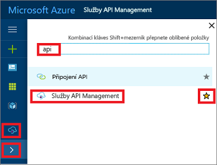

## Přejděte k vaší instanci APIM

Přejděte k vaší instanci APIM, postupujte takto:

1. Přihlaste se k webu [Azure Portal](https://portal.azure.com). 
2. Vyberte .
3. Do vyhledávacího pole zadejte "api".
4. Klikněte na tlačítko **služby API Management**.

    

5. Vyberte instanci služby APIM.

>[!TIP]
>Přidání rozhraní API správy (APIM) do vašich oblíbených položek na portálu Azure kliknutím na ikonu hvězdičky.  Tento postup přidá ikonu APIM do nabídky na levé straně na portálu. Chcete-li zobrazit všechny vaše služby APIM, klikněte na ikonu ().
 

