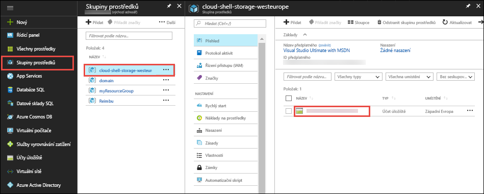
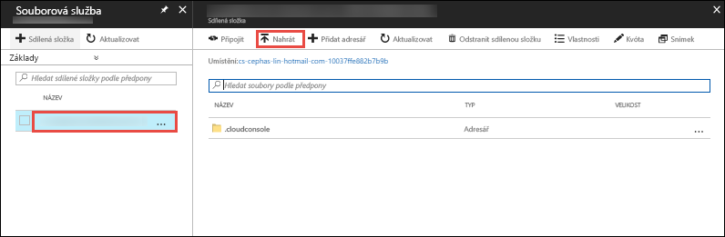

V [portál Azure](https://portal.azure.com), klikněte na tlačítko **skupiny prostředků** > **cloudu-prostředí-úložiště -\<your_region >**  >   **\<storage_account_name >**.



V **přehled** stránky účtu úložiště, vyberte **soubory**.

Vyberte automaticky generované sdílené složky a vyberte **nahrát**. Tuto sdílenou složku připojené v prostředí cloudu jako `clouddrive`.



Klikněte na tlačítko modulu pro výběr souborů a souboru ZIP a potom klikněte na tlačítko **nahrát**. 

V prostředí cloudu, použijte `ls` ověřit, zda se zobrazí nahrávaný soubor ZIP ve výchozí `clouddrive` sdílet.

```azurecli-interactive
ls clouddrive
```
