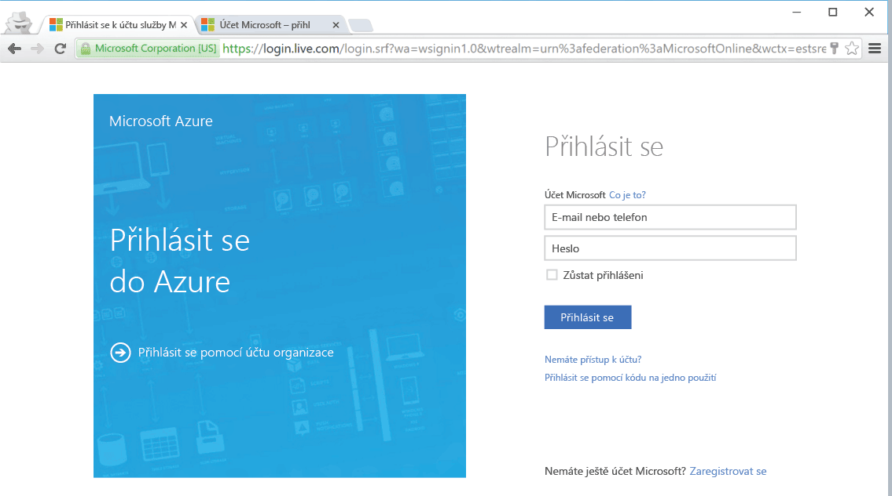

<!--
includes/azure-include-getting-started-v12portal-gettings-an-account.md

Latest Freshness check:  2016-04-11 , carlrab.

As of circa 2016-04-11, the following topics might include this include:
articles/sql-database/sql-database-get-started-tutorial.md

-->
## Připojení k portálu Microsoft Azure s předplatným

Pokud se chcete připojit k portálu Microsoft Azure, potřebujete předplatné. 

### Získání nového účtu

Pokud nemáte účet služby Microsoft Azure, pomocí některého z následujících odkazu si ho pořiďte:

- Získání [bezplatného účtu](https://azure.microsoft.com/get-started/)
- Použití [předplatného MSDN](https://azure.microsoft.com/pricing/member-offers/msdn-benefits/)

###Přihlášení pomocí existujícího účtu

Pokud máte [existující předplatné]( https://account.windowsazure.com/Home/Index), pomocí níže uvedeného postupu se připojte k portálu Azure. 

1. Otevřete prohlížeč, kterému dáváte přednost, a připojte se k [portálu Azure](https://portal.azure.com/).

1. Přihlaste se k webu [Portál Azure](https://portal.azure.com/).

1. Když se zobrazí přihlašovací stránka, zadejte přihlašovací údaje pro své předplatné.

   
   

<!--HONumber=Aug16_HO4-->

