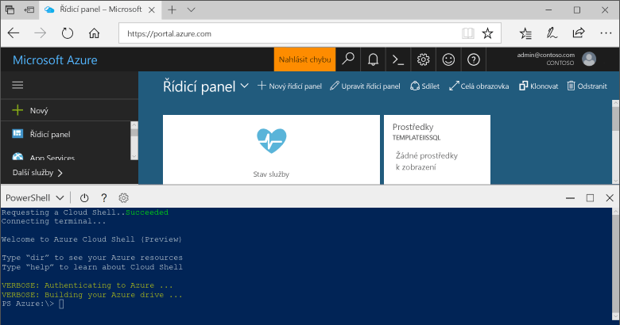

## Spuštění služby Azure Cloud Shell

Služba Azure Cloud Shell je volně dostupné prostředí, které můžete spustit přímo z portálu Azure Portal. Má předinstalované obecné nástroje Azure, které jsou nakonfigurované pro použití s vaším účtem. Klikněte na tlačítko **Cloud Shell** v nabídce v pravé horní části portálu [Azure Portal](https://portal.azure.com).

Toto tlačítko spustí interaktivní prostředí, které můžete použít k provedení všech kroků v tématu:

