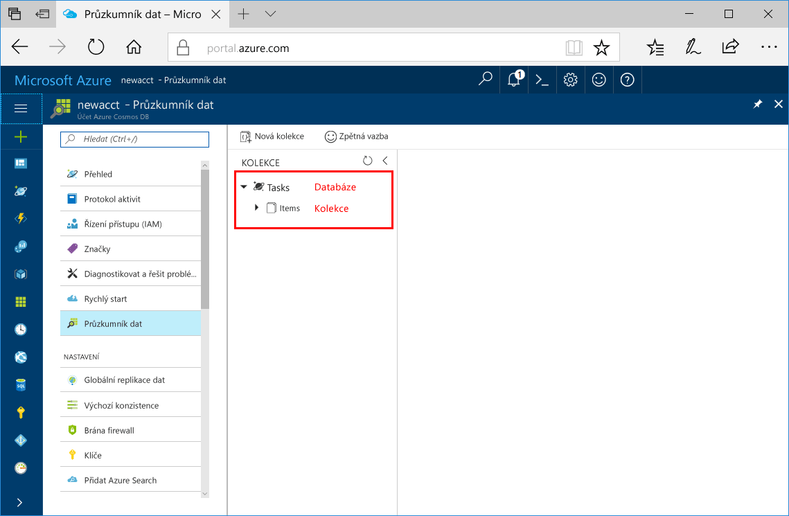

Teď můžete pomocí nástroje Průzkumník dat na webu Azure Portal vytvořit databázi a kolekci. 

1. Klikněte na **Průzkumník dat** > **Nová kolekce**. 
    
    Úplně vpravo se zobrazí oblast **Přidat kolekci**. Pokud ji nevidíte, možná se budete muset posunout doprava.

    

2. Na stránce **Přidat kolekci** zadejte nastavení pro novou kolekci.

    Nastavení|Navrhovaná hodnota|Popis
    ---|---|---
    ID databáze|Úlohy|Jako název nové databáze zadejte *Tasks*. Názvy databází musí mít délku 1 až 255 znaků a nesmí obsahovat znaky /, \\, #, ? ani koncové mezery.
    ID kolekce|Items|Jako název nové kolekce zadejte *Items*. ID kolekcí mají stejné požadavky na znaky jako názvy databází.
    Kapacita úložiště| Pevná (10 GB)|Změňte hodnotu na **Pevná (10 GB)**. Tato hodnota je kapacita úložiště databáze.
    Propustnost|400 RU|Změňte propustnost na 400 jednotek žádostí za sekundu (RU/s). Abyste mohli propustnost nastavit na 400 RU/s, kapacita úložiště musí být nastavená na **Pevná (10 GB)**. Pokud budete chtít snížit latenci, můžete propustnost později navýšit. 
    
    Klikněte na **OK**.

    Průzkumník dat zobrazí novou databázi a kolekci.

    