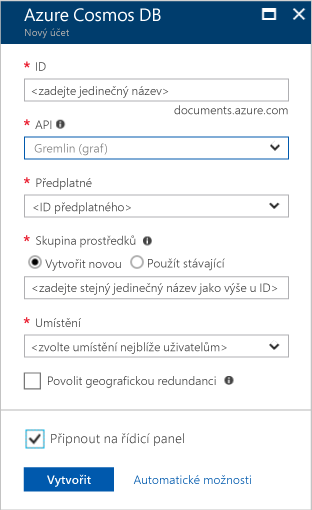

1. V nové okno prohlížeče, přihlaste se k [portál Azure](https://portal.azure.com/).

2. Klikněte na tlačítko **vytvořit prostředek** > **databáze** > **Azure Cosmos DB**.
   
   

3. V **nový účet** zadejte nastavení pro nový účet Azure Cosmos DB. 

    Nastavení|Navrhovaná hodnota|Popis
    ---|---|---
    ID|*Zadejte jedinečný název*|Zadejte jedinečný název pro identifikaci tohoto účtu Azure Cosmos DB. Jelikož je řetězec *documents.azure.com* připojený k ID, které poskytnete k vytvoření identifikátoru URI, použijte jedinečné, ale snadno rozpoznatelné ID.  Toto ID může obsahovat pouze malá písmena, číslice a znak spojovníku (-) a musí se skládat ze 3 až 50 znaků.
    Rozhraní API|Gremlin (graf)|Rozhraní API Určuje typ účtu chcete-li vytvořit. Poskytuje Azure Cosmos DB pět rozhraní API pro vyhovuje potřebám vaší aplikace: SQL (databáze dokumentu), Gremlin (grafu databáze), MongoDB (databáze dokumentu), Azure Table a Cassandra, každý, které aktuálně vyžadují samostatný účet.   Vyberte **Gremlin (grafu)** vzhledem k tomu, že v tento rychlý start vytváříte graf, který je dotazovatelný pomocí syntaxe Gremlin.  [Další informace o rozhraní Graph API](../articles/cosmos-db/graph-introduction.md)
    Předplatné|*Vaše předplatné*|Vyberte předplatné Azure, který chcete použít pro tento účet Azure Cosmos DB. 
    Skupina prostředků|*Zadejte stejný jedinečný název, který výše uvedeného v ID*|Zadejte nový název skupiny prostředků pro váš účet. V zájmu jednoduchosti můžete použít název, který se shoduje s vaším ID. 
    Umístění|*Vyberte oblast nejbližší uživatelům.*|Vyberte zeměpisné umístění, ve kterém k hostování účtu Azure Cosmos DB. Použijte umístění, které je nejblíže k uživatelům poskytnout nejrychlejší přístup k datům.
    Povolit geografickou redundanci| Ponechte prázdné | Tím se vytvoří replikované verzi databáze v druhé (spárované) oblasti. Nechte prázdné.  
    Připnutí na řídicí panel | Vyberte | Zaškrtněte toto políčko, aby nový databázový účet se přidá do řídicího panelu portálu pro snadný přístup.

    Poté klikněte na **Vytvořit**.

    

4. Vytvoření účtu trvá několik minut. Během účet vytvoření portálu zobrazí **nasazení Azure DB Cosmos** dlaždici na pravé straně, budete muset přejděte přímo na řídicím panelu zobrazíte dlaždici. Je také zobrazí v horní části obrazovky indikátor průběhu. Můžete sledovat průběh buď oblasti.

    

    Po vytvoření účtu **Blahopřejeme! Byl vytvořen účet Azure Cosmos DB** zobrazí se stránka. 