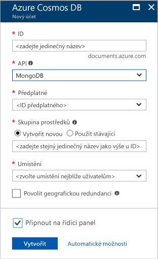
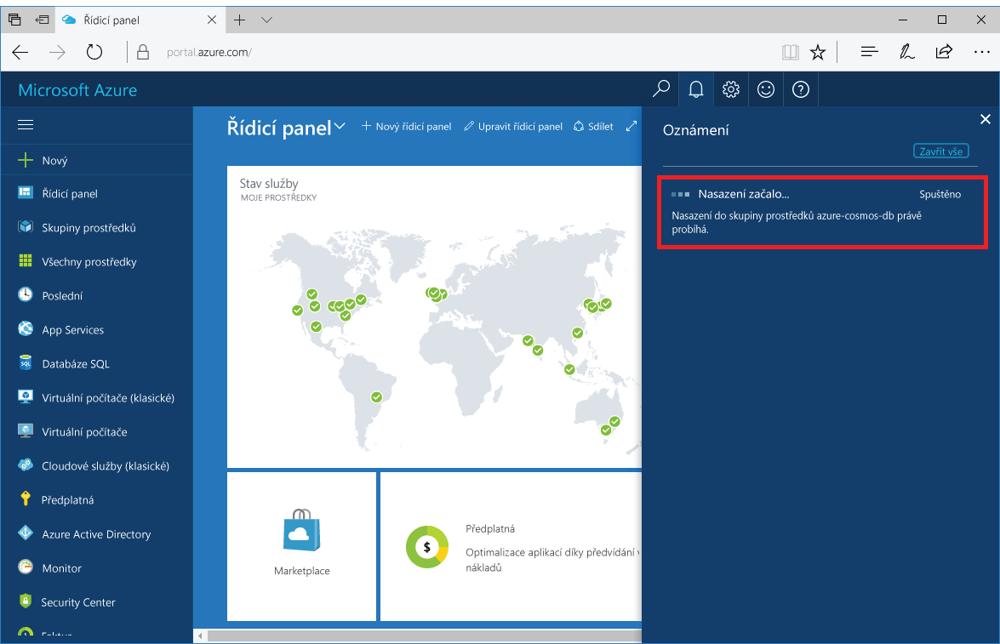
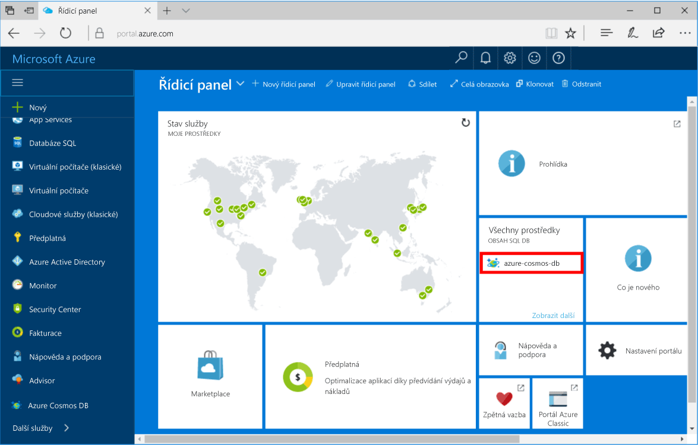

1. V novém okně se přihlaste k webu [Azure Portal](https://portal.azure.com/).
2. V nabídce vlevo klikněte na **Nový**, potom na **Databáze** a nakonec na **Databáze Azure Cosmos**.
   
   

3. V okně **Nový účet** zadejte požadovanou konfiguraci účtu databáze Azure Cosmos. 

    V databázi Azure Cosmos můžete vybrat jeden ze čtyř programovacích modelů: Gremlin (graf), MongoDB, SQL (DocumentDB) a Tabulka (klíč-hodnota). 
       
    V tomto rychlém startu budeme programovat s využitím rozhraní API MongoDB, takže při vyplňování formuláře vyberete možnost **MongoDB**. Pokud ale máte data grafu pro aplikaci sociálních médií, data dokumentu z aplikace katalogu nebo data typu klíč/hodnota (tabulka), je dobré si uvědomit, že databáze Azure Cosmos může poskytnout vysoce dostupnou a globálně distribuovanou platformu databázové služby pro všechny důležité podnikové aplikace.

    Vyplňte okno **Nový účet** a jako vodítko při tom použijte informace uvedené v tabulce.
 
    
   
    Nastavení|Navrhovaná hodnota|Popis
    ---|---|---
    ID|*Jedinečná hodnota*|Jedinečný název, pomocí kterého chcete identifikovat účet databáze Azure Cosmos. K zadanému ID se připojí řetězec *documents.azure.com*, čímž vznikne váš identifikátor URI, takže zadejte jedinečné, ale snadno rozpoznatelné ID. ID smí obsahovat jenom malá písmena, číslice a znak spojovníku a musí se skládat ze 3 až 50 znaků.
    Rozhraní API|MongoDB|Dál v tomto článku budeme programovat za použití [rozhraní API MongoDB](../articles/documentdb/documentdb-protocol-mongodb.md).|
    Předplatné|*Vaše předplatné*|Předplatné Azure, se kterým chcete účet databáze Azure Cosmos používat. 
    Skupina prostředků|*Stejná hodnota jako ID*|Nový název skupiny prostředků pro váš účet. V zájmu jednoduchosti můžete použít název, který se shoduje s vaším ID. 
    Umístění|*Oblast nejbližší vašim uživatelům*|Zeměpisné umístění, ve kterém chcete účet databáze Azure Cosmos hostovat. Vyberte umístění, které má nejblíž k vašim uživatelům, abyste jim zajistili nejrychlejší přístup k datům.

4. Kliknutím na **Vytvořit** vytvořte účet.
5. Na panelu nástrojů klikněte na **Oznámení** a sledujte proces nasazení.

    

6.  Po dokončení nasazení otevřete nový účet na dlaždici Všechny prostředky. 

    
