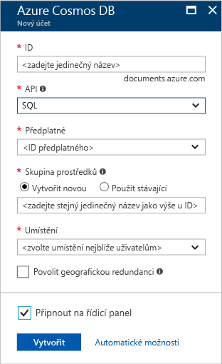

1. V novém okně se přihlaste k webu [Azure Portal](https://portal.azure.com/).
2. V levém podokně klikněte na **Nový**, potom na **Databáze** a nakonec v části **Databáze Azure Cosmos** klikněte na **Vytvořit**.
   
   

3. V okně **Nový účet** zadejte požadovanou konfiguraci pro tento účet Azure Cosmos DB. 

    Ve službě Azure Cosmos DB můžete vybrat jeden ze čtyř programovacích modelů: Gremlin (graf), MongoDB, SQL (DocumentDB) a Tabulka (klíč-hodnota). Každý z nich aktuálně vyžaduje samostatný účet.
    
    V tomto článku rychlého zprovoznění programujeme s využitím rozhraní DocumentDB API, takže při vyplňování formuláře vyberte možnost **SQL (DocumentDB)**. Pokud máte data grafu pro aplikaci sociálních médií, data typu klíč/hodnota (tabulka) nebo data migrovaná z aplikace MongoDB, je dobré si uvědomit, že služba Azure Cosmos DB může poskytnout vysoce dostupnou a globálně distribuovanou platformu databázové služby pro všechny důležité podnikové aplikace.

    V okně **Nový účet** vyplňte pole podle informací v následujícím snímku obrazovky – ty slouží pouze jako vodítko, vaše hodnoty se můžou od hodnot na snímku obrazovky lišit.
 
    

    Nastavení|Navrhovaná hodnota|Popis
    ---|---|---
    ID|*Jedinečná hodnota*|Jedinečný název, který identifikuje tento účet Azure Cosmos DB. Jelikož je řetězec *documents.azure.com* připojený k ID, které poskytnete k vytvoření identifikátoru URI, použijte jedinečné, ale snadno rozpoznatelné ID. Toto ID může obsahovat pouze malá písmena, číslice a znak spojovníku (-) a musí se skládat ze 3 až 50 znaků.
    Rozhraní API|SQL (DocumentDB)|Dál v tomto článku budeme programovat za použití [rozhraní DocumentDB API](../articles/documentdb/documentdb-introduction.md).|
    Předplatné|*Vaše předplatné*|Předplatné Azure, které chcete pro tento účet Azure Cosmos DB použít. 
    Skupina prostředků|*Stejná hodnota jako ID*|Nový název skupiny prostředků pro váš účet. V zájmu jednoduchosti můžete použít název, který se shoduje s vaším ID. 
    Umístění|*Oblast nejbližší vašim uživatelům*|Zeměpisné umístění, ve kterém chcete účet databáze Azure Cosmos hostovat. Vyberte umístění, které je vašim uživatelům nejbližší, abyste jim zajistili nejrychlejší přístup k datům.
4. Kliknutím na **Vytvořit** vytvořte účet.
5. Pokud chcete monitorovat proces nasazení, na horním panelu nástrojů klikněte na ikonu **Oznámení** .

    

6.  Když okno Oznámení značí, že nasazení proběhlo úspěšně, zavřete okno oznámení a otevřete nový účet z dlaždice **Všechny prostředky** na řídicím panelu. 

    
 
