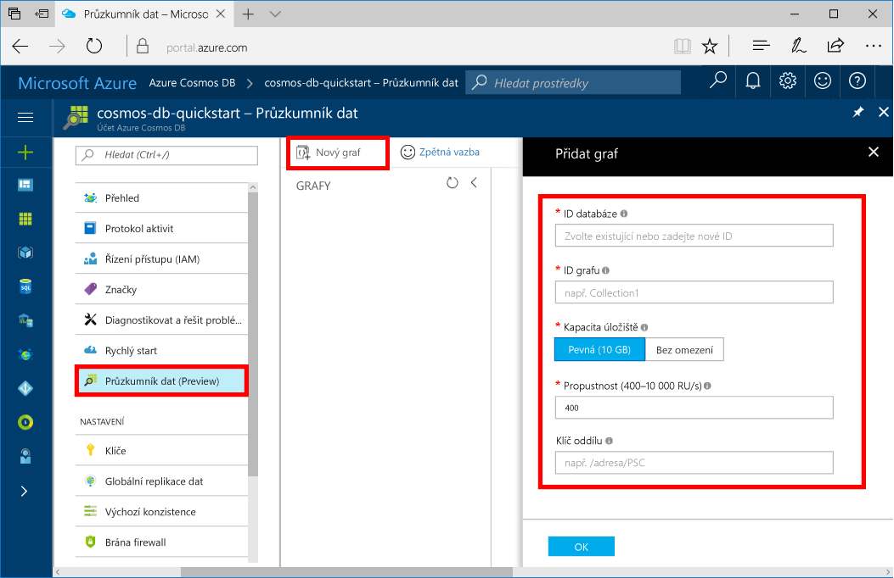

Teď můžete pomocí nástroje Průzkumník dat na webu Azure Portal vytvořit databázi grafu. 

1. Na portálu Azure, v nabídce na levé straně vyberte **Data Explorer (Preview)**.

2. V části **Data Explorer (Preview)**, vyberte **nový graf**. Pak zadejte na stránce pomocí následující informace:

    

    Nastavení|Navrhovaná hodnota|Popis
    ---|---|---
    ID databáze|sample-database|ID vaší nové databáze. Názvy databází musí být v rozmezí 1 až 255 znaků a nesmí obsahovat `/ \ # ?` nebo koncové mezery.
    ID grafu|sample-graph|ID vašeho nového grafu. Názvy grafu mají stejné požadavky znak jako ID databáze.
    Kapacita úložiště| 10 GB|Nechte zadanou výchozí hodnotu. Tohle je kapacita úložiště databáze.
    Propustnost|400 RU/s|Nechte zadanou výchozí hodnotu. Propustnost můžete později navýšit, pokud budete chtít snížit latenci.
    Klíč oddílu|/FirstName|Klíč oddílu, který rovnoměrně distribuuje data do jednotlivých oddílů. Výběr klíč správné oddílu je důležité při vytváření původce grafu. Další informace najdete v tématu [návrh a vytváření oddílů](../articles/cosmos-db/partition-data.md#designing-for-partitioning).

3. Když je formulář vyplnit, vyberte **OK**.
