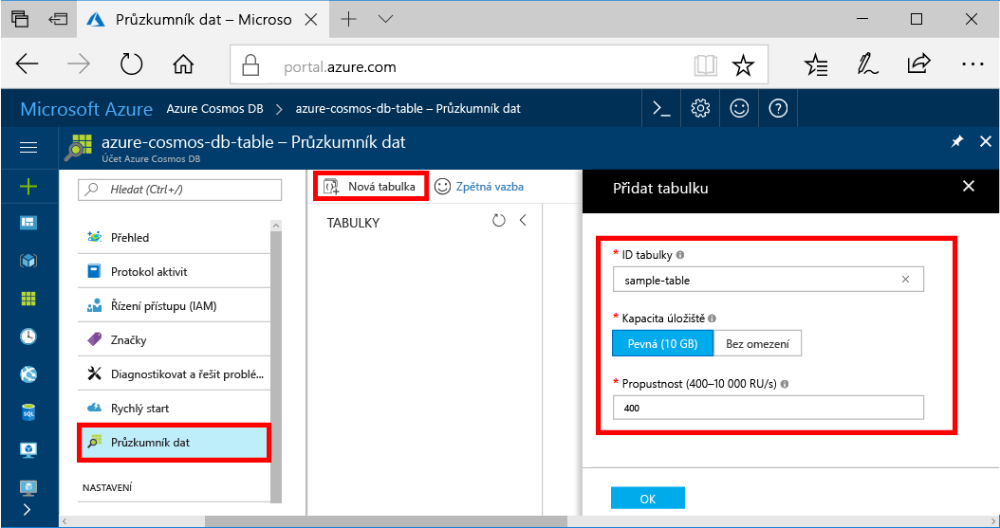
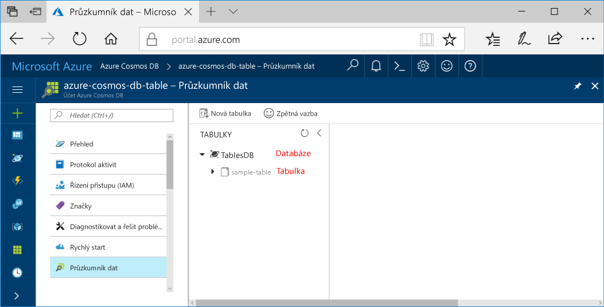

Teď můžete použít nástroj Průzkumník dat v portálu Azure k vytvoření databáze a tabulky. 

1. Klikněte na tlačítko **Průzkumníku dat** > **novou tabulku**. 
    
    **Přidat tabulku** oblasti se zobrazí v pravém, budete muset přejděte přímo k jeho zobrazení.

    

2. V **přidat tabulku** zadejte nastavení pro novou tabulku.

    Nastavení|Navrhovaná hodnota|Popis
    ---|---|---
    ID tabulky|sample-table|ID vaší nové tabulky. Názvy tabulek mají stejné požadavky na znaky jako ID databází. Názvy databází musí mít délku 1 až 255 znaků a nesmí obsahovat znaky `/ \ # ?` ani koncové mezery.
    Kapacita úložiště| Pevná (10 GB)|Změňte hodnotu na **Fixed (10 GB)**. Tato hodnota je kapacita úložiště databáze.
    Propustnost|400 RU/s|Změňte propustnosti na 400 jednotek žádosti za sekundu (RU/s). Pokud budete chtít snížit latenci, můžete propustnost později navýšit.

    Klikněte na **OK**.

    Průzkumník dat zobrazí novou databázi a tabulku.

    