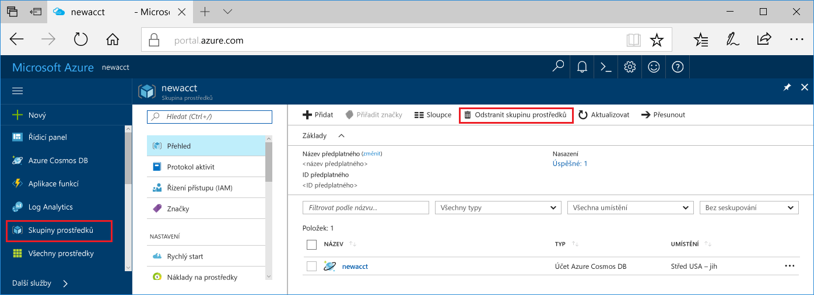

Pokud nechcete pokračovat v používání této aplikace, odstraňte všechny prostředky, které jsou vytvořené tento rychlý start pomocí následujících kroků, aby vám zbytečně nenabíhaly žádné poplatky za:

1. Na portálu Azure vyberte **skupiny prostředků** zcela vlevo.  

   

2. Ze seznamu skupin prostředků, vyberte skupinu prostředků, které jste vytvořili a pak klikněte na tlačítko **odstranit skupinu prostředků**.

3. Zadejte název skupiny prostředků odstranit, a pak klikněte na **odstranit**.

