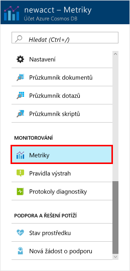
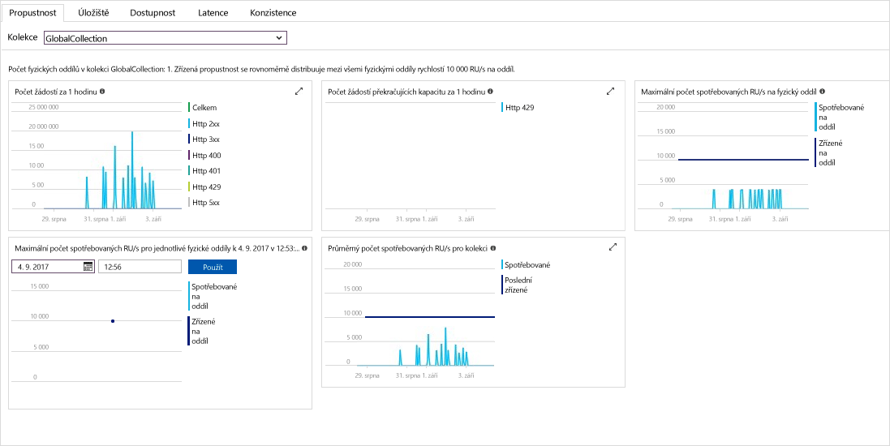

Propustnost, úložiště, dostupnosti, latence a konzistence prostředků ve vašem účtu jsou monitorovány na portálu Azure. Podívejme se rychlé na tyto metriky. 

1. Klikněte na tlačítko **metriky** v navigační nabídce.

   

2. Klikněte na tlačítko prostřednictvím karty, takže jste vědět metriky, které poskytuje Azure Cosmos DB. 

    Každý graf, který je přidružen [Azure Cosmos DB smlouvy o úrovni služeb (SLA)](https://azure.microsoft.com/support/legal/sla/cosmos-db/) poskytuje řádek, který ukazuje, pokud byla porušena kterákoli z smluv SLA. Díky Azure Cosmos DB je monitorování vaší transparentní s této sady metriky SLA. 

   