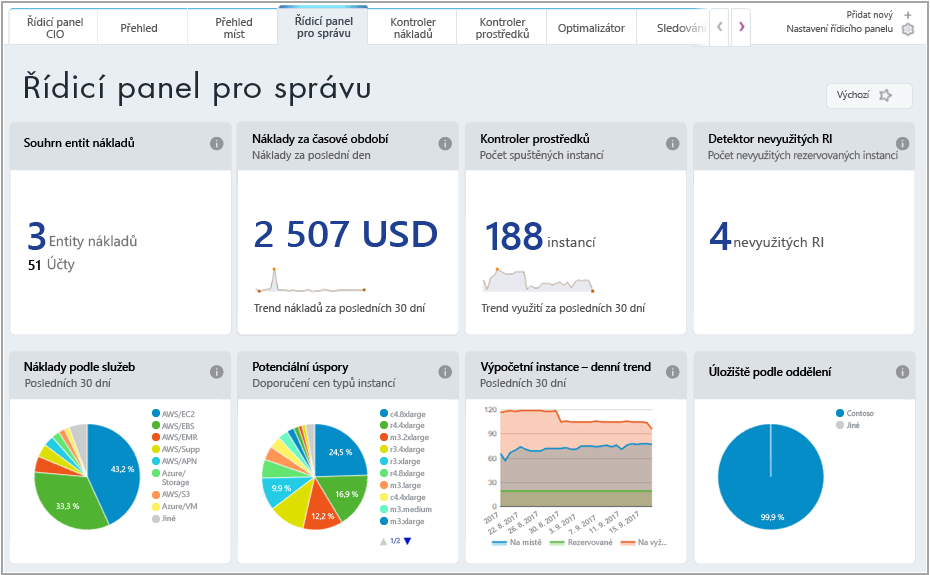
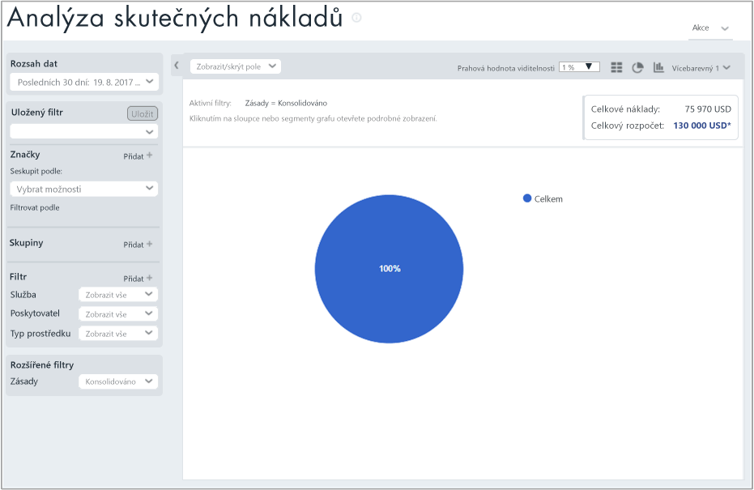
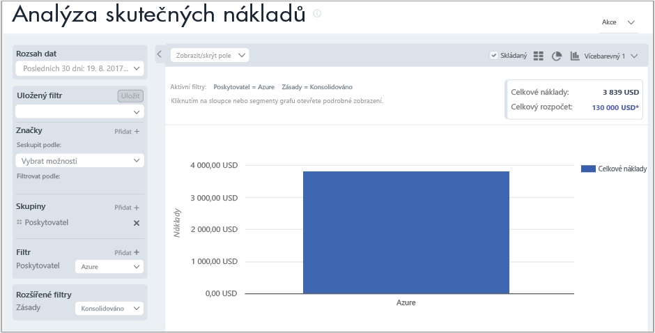
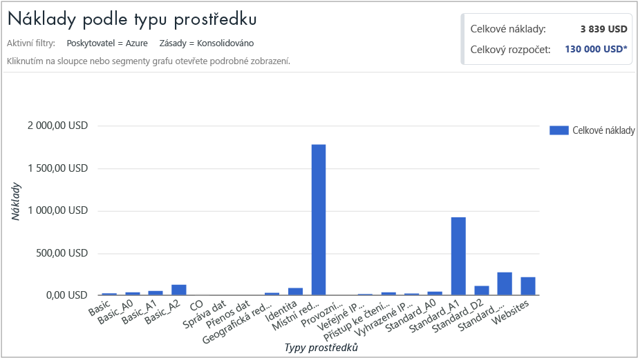
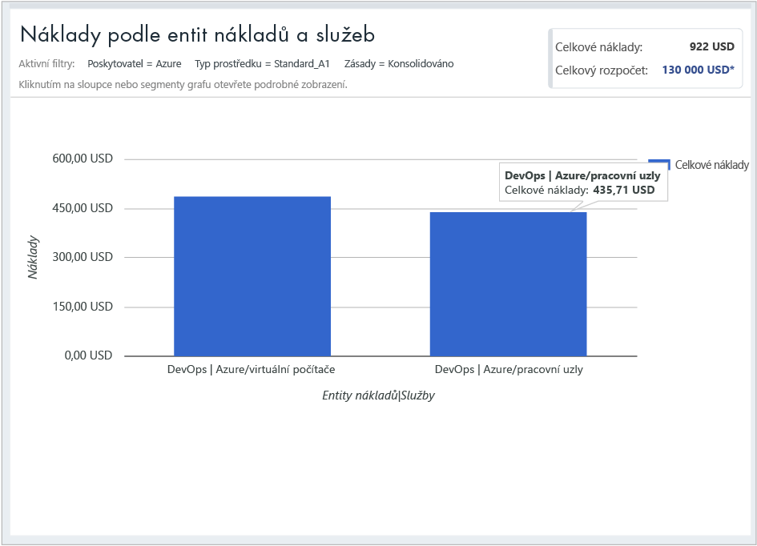

## Zobrazení informací o nákladech

Azure Cost Management by Cloudyn poskytuje přístup ke všem datům cloudových prostředků. V sestavách řídicího panelu najdete standardní i vlastní sestavy v zobrazení se záložkami. Následují příklady oblíbeného řídicího panelu a sestavy, která ukazuje okamžité informace o vašich nákladech.

V tomto příkladu řídicí panel správy ukazuje souhrnné náklady firmy Contoso napříč všemi jejími cloudovými prostředky. Contoso používá Azure, AWS a Google. Řídicí panely poskytují okamžité informace a představují rychlý způsob přechodu k sestavám.  

Pokud si nejste jisti účelem sestavy na řídicím panelu a chcete zobrazit vysvětlení, najeďte myší na symbol **i**. Kliknutím na jakoukoli sestavu na řídicím panelu zobrazíte úplnou sestavu.

Sestavy můžete zobrazit také pomocí nabídky sestav v horní části portálu. Podívejme se na náklady společnosti Contoso na prostředky Azure za posledních 30 dnů. Klikněte na **Cost** (Náklady) > **Cost Analysis** (Analýza nákladů) > **Actual Cost Analysis** (Analýza skutečných nákladů). Pokud jsou ve vaší sestavě nastavené nějaké hodnoty pro značky, skupiny nebo filtry, vymažte je.

V tomto příkladu jsou celkové náklady 75 970 USD a rozpočet je 130 000 USD.

Nyní upravíme formát sestavy a nastavíme skupiny a filtry, abychom omezili výsledky na náklady na Azure. Nastavte **Date Range** (Rozsah dat) na posledních 30 dnů. Kliknutím na symbol sloupce vpravo nahoře nastavte formát na pruhový graf a v části Skupiny vyberte **Provider** (Poskytovatel). Potom nastavte filtr **Provider** (Poskytovatel) na **Azure**.

V tomto příkladu byly celkové náklady na prostředky Azure za posledních 30 dnů 3 839 USD.

Klikněte pravým tlačítkem na pruh Provider (Azure) a rozbalte **Resource types** (Typy prostředků).

Následující obrázek ukazuje náklady na prostředky Azure účtované společnosti Contoso. Celkové náklady byly 3 839 USD. V tomto příkladu byla přibližně polovina nákladů na místně redundantní úložiště a přibližně polovina na různé instance virtuálních počítačů.

Klikněte pravým tlačítkem na typ prostředku a výběrem možnosti **Cost entities** (Entity nákladů) zobrazte entity nákladů a služby, které spotřebovaly tyto prostředky. Virtuální počítače a služby Worker v DevOps v tomto příkladu spotřebovaly 486,60 USD a 435,71 USD. Celkové náklady na obojí jsou 922 USD.

Podívejte se na kurz video o zobrazení vašeho cloudu fakturace data, najdete v tématu [analýza cloudu fakturace dat pomocí Azure náklady na správu Cloudyn](https://youtu.be/G0pvI3iLH-Y).
