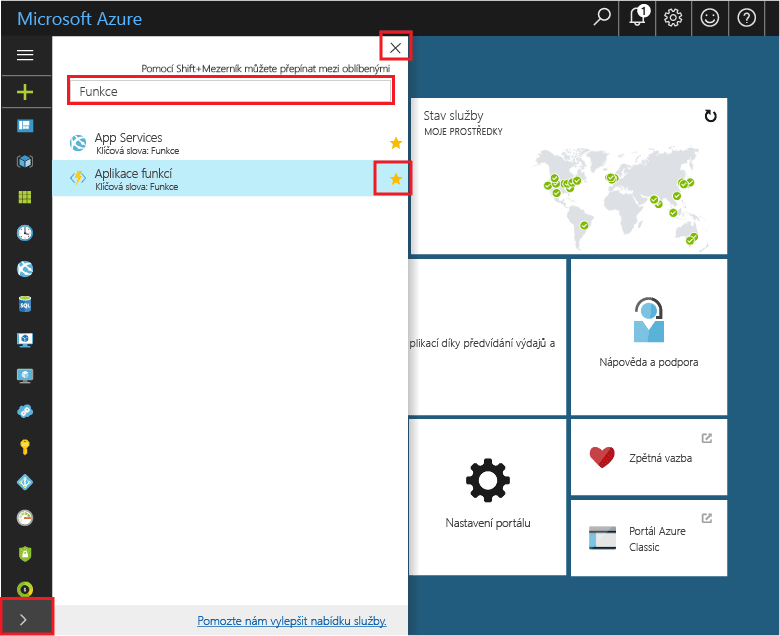
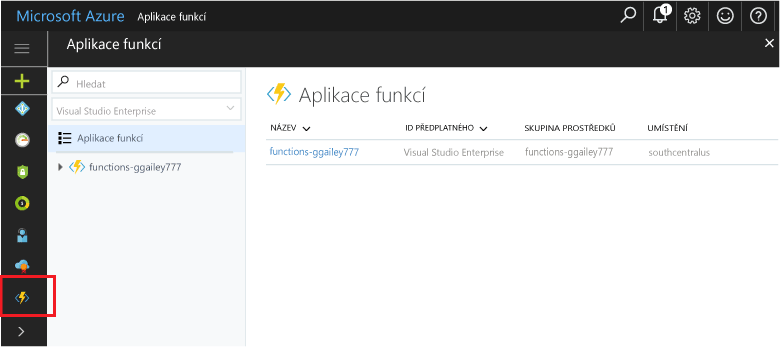

## Oblíbené funkce na portálu 

Pokud jste to ještě neudělali, přidejte si aplikace Function App mezi oblíbené položky na webu Azure Portal. Díky tomu pak svoje aplikace Function App snadněji najdete. Pokud jste to už udělali, přejděte k další části. 

1. Přihlaste se k [portálu Azure](https://portal.azure.com/).

2. Kliknutím na šipku vlevo dole rozbalte všechny služby, do pole **Filtr** zadejte `Functions` a potom klikněte na hvězdičku vedle možnosti **Aplikace Function App**.  
 
    

    Tím přidáte do nabídky na levé straně portálu ikonu Funkce.

3. Zavřete nabídku a potom přejděte úplně dolů, kde uvidíte ikonu Funkce. Kliknutím na tuto ikonu zobrazíte seznam všech aplikací Function App. Po kliknutí na určitou aplikaci Function App můžete pracovat s funkcemi této aplikace. 
 
    
 
     