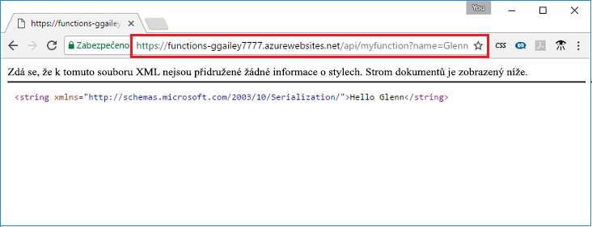

## <a name="test"></a>Testování funkce

Na počítačích se systémem Mac nebo Linux otestujete nasazenou funkci pomocí cURL nebo v systému Windows pomocí skriptu Bash. Proveďte následující příkaz cURL, který nahradí zástupný symbol `<app_name>` názvem vaší aplikace Function App. Připojte řetězec dotazu `&name=<yourname>` k adrese URL.

```bash
curl http://<app_name>.azurewebsites.net/api/HttpTriggerJS1?name=<yourname>
```  

  

Pokud nemáte cURL k dispozici v příkazovém řádku, zadejte stejnou adresu URL do pole adresy ve webovém prohlížeči. Znovu nahraďte zástupný symbol `<app_name>` názvem aplikace Function App, připojte řetězec dotazu `&name=<yourname>` k adrese URL a proveďte požadavek. 

    http://<app_name>.azurewebsites.net/api/HttpTriggerJS1?name=<yourname>
   
  
