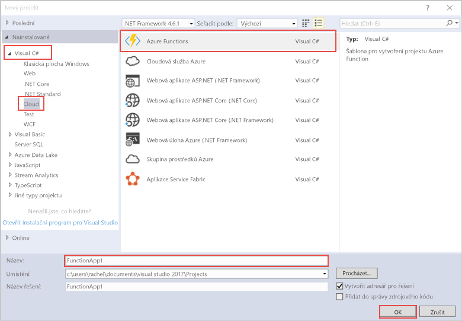

Šablona projektu Azure Functions v sadě Visual Studio vytvoří projekt, který jde publikovat do aplikace funkcí v Azure. Aplikace Function App umožňuje seskupit funkce jako logickou jednotku pro snadnější správu, nasazování a sdílení prostředků.   

1. V **Průzkumníku řešení** klikněte pravým tlačítkem na uzel projektu a pak zvolte **Přidat** > **Nová položka**. V dialogovém okně zvolte **Funkce Azure**.

2. V dialogovém okně **Nový projekt** rozbalte uzel **Visual C#** > **Cloud**, vyberte **Azure Functions**, zadejte **název** vašeho projektu a klikněte na **OK**. Název aplikace funkcí musí být platný jako obor názvů C#, takže nepoužívejte podtržítka, pomlčky nebo jiné nealfanumerické znaky. 

    