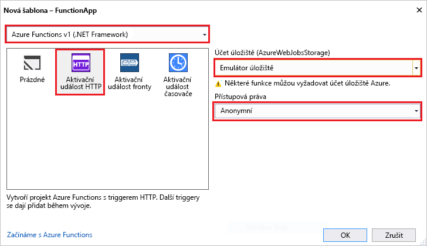

Šablona projektu Azure Functions v sadě Visual Studio vytvoří projekt, který jde publikovat do aplikace funkcí v Azure. Umožňuje aplikaci funkce skupiny funkce jako logickou jednotku pro správu, nasazení a sdílení prostředků.   

1. V sadě Visual Studio, vyberte **nový** > **projektu** z **souboru** nabídky. 

2. V **nový projekt** dialogovém okně, vyberte **nainstalovaná**, rozbalte položku **Visual C#** > **cloudu**, vyberte **Azure Funkce**, zadejte **název** pro váš projekt a klikněte na tlačítko **OK**. Název aplikace funkcí musí být platný jako obor názvů C#, takže nepoužívejte podtržítka, pomlčky nebo jiné nealfanumerické znaky. 

     

2. Použití nastavení uvedeného v následující tabulce bitovou kopii.
 
     

    | Nastavení      | Navrhovaná hodnota  | Popis                      |
    | ------------ |  ------- |----------------------------------------- |
    | **Verze** | Azure Functions v1  (Rozhraní .NET framework) | Tím se vytvoří funkce projekt, který používá modul runtime Azure Functions verze 1. Modul runtime verze 2, který podporuje .NET Core, je aktuálně ve verzi preview. Další informace najdete v tématu [postup cílovou verzi modulu runtime Azure Functions](../articles/azure-functions/functions-versions.md).   | 
    | **Šablona** | Trigger HTTP | Tím se vytvoří funkci aktivovány požadavek HTTP. |
    | **Účet úložiště**  | Emulátor úložiště | Aktivační událost INSTEAD HTTP nepoužívá účet připojení k úložišti. Všechny ostatní typy aktivační událost vyžadovat platný připojovací řetězec účet úložiště. |
    | **Přístupová práva** | Anonymní | Vytvoření funkce mohou být spouštěny libovolného klienta bez zadání klíče. Toto nastavení autorizace usnadňuje novou funkci otestovat. Další informace o klíčích a autorizace najdete v tématu [autorizace klíče](../articles/azure-functions/functions-bindings-http-webhook.md#authorization-keys) v [vazby HTTP a webhooku](../articles/azure-functions/functions-bindings-http-webhook.md). |         
3. Klikněte na tlačítko **OK** funkci vytvoříte projekt a HTTP aktivované funkce. 

