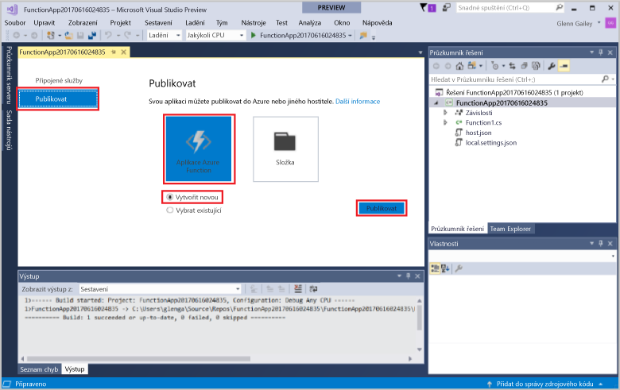
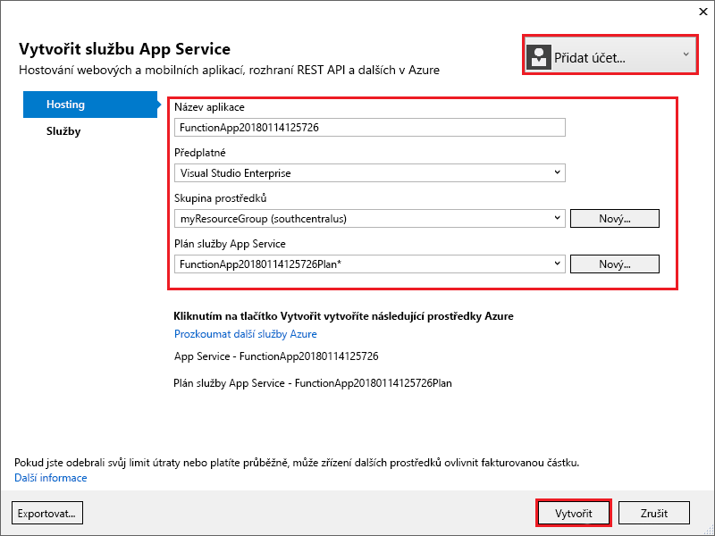
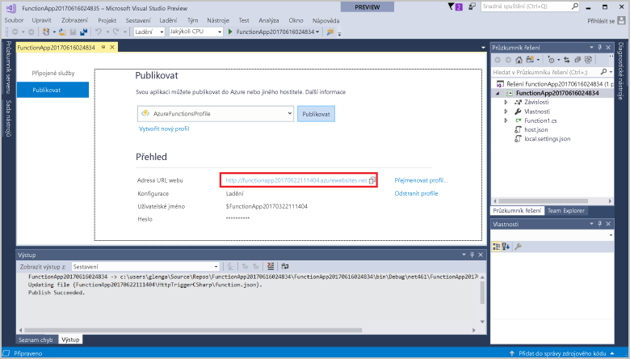

V **Průzkumníku řešení** klikněte pravým tlačítkem na požadovaný projekt a vyberte **Publikovat**. Zvolte **Vytvořit nový** a pak klikněte na **Publikovat**. 

Pokud jste ještě nepřipojili Visual Studio k účtu Azure, klikněte na tlačítko **Přidat účet...** .  

V dialogovém okně **Vytvořit App Service** použijte nastavení hostování podle uvedené tabulky. 

| Nastavení      | Navrhovaná hodnota  | Popis                                |
| ------------ |  ------- | -------------------------------------------------- |
| **Název aplikace** | Globálně jedinečný název | Název jednoznačně identifikující novou aplikaci funkcí. |
| **Předplatné** | Vaše předplatné | Předplatné Azure, které se má použít. |
| **[Skupina prostředků](../articles/azure-resource-manager/resource-group-overview.md)** | myResourceGroup |  Název skupiny prostředků, ve které chcete vytvořit aplikaci funkcí. |
| **[Plán služby App Service](../articles/azure-functions/functions-scale.md)** | Plán Consumption | Při vytváření nového plánu nezapomeňte vybrat **Spotřeba** v části **Velikost**.  |
| **[Účet úložiště](../articles/storage/storage-create-storage-account.md#create-a-storage-account)** | Globálně jedinečný název | Použijte existující účet úložiště, nebo vytvořte nový.   |

Kliknutím na **Vytvořit** vytvoříte v Azure aplikaci funkcí s tímto nastavením. 

Po dokončení zřizování klikněte na **Publikovat**. Do nové aplikace funkcí se nasadí kód projektu. 

Poznamenejte si hodnotu **Adresa URL webu**. Je to adresa vaší aplikace funkcí v Azure. 