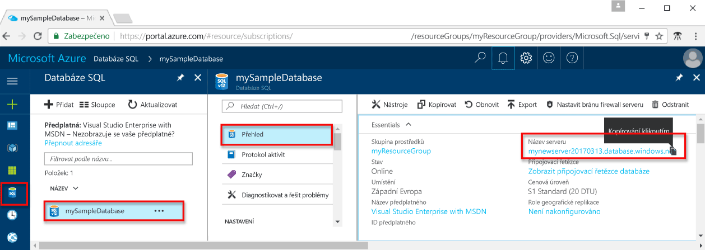

<!-- sql-database-connect-query-prerequisites-server-connection-info-includes.md 

## SQL server connection information
-->

Získejte informace o připojení potřebné pro připojení k databázi SQL Azure. V dalších postupech budete potřebovat plně kvalifikovaný název serveru, název databáze a přihlašovací údaje.

1. Přihlaste se k portálu [Azure Portal](https://portal.azure.com/).
2. V nabídce vlevo vyberte **SQL Database** a na stránce **Databáze SQL** klikněte na vaši databázi. 
3. Na stránce **Přehled** pro vaši databázi si prohlédněte plně kvalifikovaný název serveru, jak je znázorněno na následujícím obrázku. Pokud na název serveru najedete myší, můžete vyvolat možnost **Kopírování kliknutím**.  

    

4. Pokud zapomenete přihlašovací informace pro váš server, přejděte na stránku serveru služby SQL Database, abyste zobrazili jméno správce serveru. V případě potřeby obnovte heslo.

