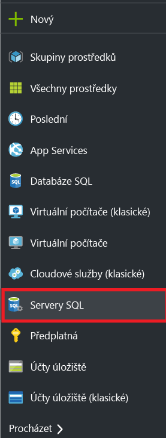
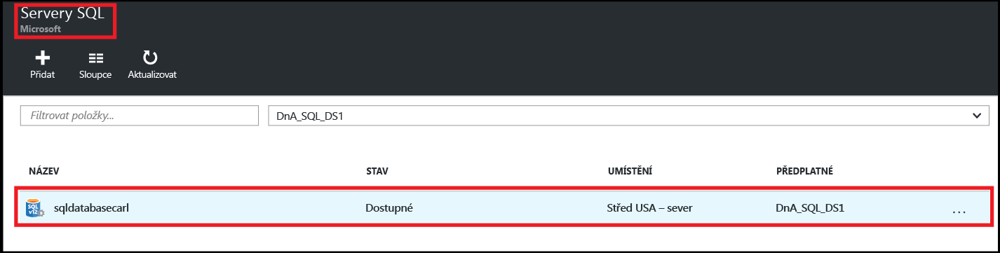
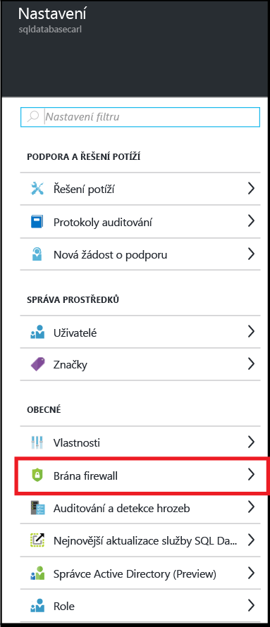
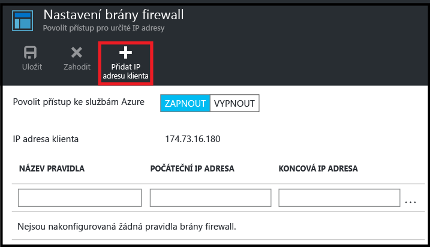
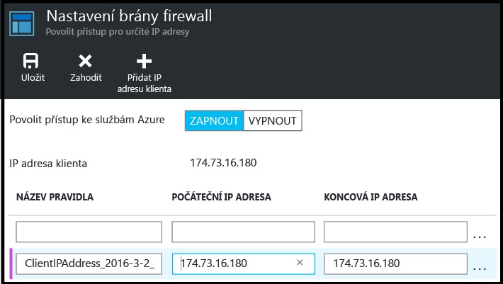
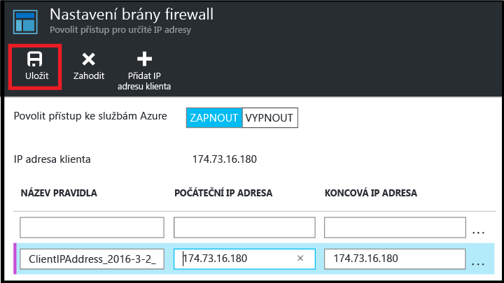

<!--
includes/sql-database-create-new-server-firewall-portal.md

Latest Freshness check:  2016-08-01 , rickbyh.

As of circa 2016-04-11, the following topics might include this include:
articles/sql-database/sql-database-get-started-tutorial.md
articles/sql-database/sql-database-configure-firewall-settings

-->
## Vytvoření nové brány firewall na úrovni serveru SQL Azure

Pomocí následujícího postupu vytvoříte na webu Azure Portal pravidlo brány firewall na úrovni serveru, které umožní připojení z jednotlivé IP adresy (vašeho klientského počítače) nebo celého rozsahu IP adres k logickému serveru služby SQL Database.

1. Pokud nejste připojeni, připojte se k webu [Azure Portal](http://portal.azure.com).
2. Ve výchozím okně klikněte na **Servery SQL**.

    

3. V okně **Servery SQL** klikněte na server, na kterém se má pravidlo brány firewall vytvořit.

    

4. Zkontrolujte vlastnosti serveru.

    

5. V okně **Nastavení** klikněte na **Brána firewall**.

    

    > [AZURE.NOTE] K oknu **Nastavení brány firewall** na úrovni serveru se dostanete také z panelu nástrojů v okně **Databáze**.

6. Klikněte na **Přidat IP adresu klienta** a Azure vytvoří pravidlo pro vaši IP adresu klienta.

      

7. Případně můžete kliknout na přidanou IP adresu a upravit adresu brány firewall. Tím povolíte přístup k rozsahu IP adres.

      

8. Klikněte na tlačítko **Uložit** a vytvořte tak pravidlo brány firewall na úrovni serveru.

     

    >[AZURE.IMPORTANT] Vaše IP adresa klienta se občas může změnit a vy pak nebudete mít přístup k serveru, dokud nevytvoříte nové pravidlo brány firewall. IP adresu můžete zkontrolovat pomocí [Bing](http://www.bing.com/search?q=my%20ip%20address). Poté přidejte jednu IP adresu nebo rozsah IP adres. Podrobnosti najdete v tématu [Správa nastavení brány firewall](sql-database-configure-firewall-settings.md#manage-existing-server-level-firewall-rules-through-the-azure-portal).

<!--HONumber=Sep16_HO3-->

