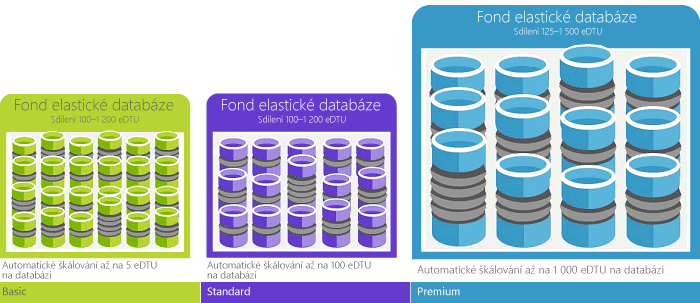

Jednotka databázové transakce (DTU) je měrnou jednotkou služby SQL Database, která představuje relativní výkon databází na základě reálného měření: databázové transakce. Vzali jsme sadu operací, které jsou typické pro požadavek na online zpracování transakcí (OLTP), a změřili jsme, kolik transakcí je možné dokončit za jednu sekundu v podmínkách plného zatížení (tolik ve zkratce, sáhodlouhý příběh si můžete přečíst v [přehledu srovnávacího testu](../articles/sql-database/sql-database-benchmark-overview.md)). 

Například databáze Premium P11 se 1 750 DTU nabízí 350x více DTU výpočetního výkonu než databáze Basic s 5 DTU. 

> [!NOTE]
> Pokud migrujete existující databázi serveru SQL Server a chcete získat odhad úrovně výkonu a úrovně služby, které může databáze vyžadovat ve službě Azure SQL Database, můžete použít nástroj třetí strany [kalkulačka DTU databáze SQL Azure](http://dtucalculator.azurewebsites.net/).
> 
> 

### DTU vs. eDTU
DTU jednotlivých databází se překládá přímo na eDTU elastických databází. Například databáze ve fondu elastické databáze Basic nabízí až 5 eDTU. Je to stejný výkon jako v případě jedné databáze Basic. Rozdílem je, že elastická databáze nespotřebuje žádné eDTU z fondu, dokud nemusí. 

Jednoduchý příklad usnadní pochopení. Vezměte fond elastické databáze Basic s 1 000 DTU a vložte do něj 800 databází. Tak dlouho, dokud v libovolném bodě v čase využíváte jenom 200 z 800 databází (5 DTU x 200 = 1 000), nedosáhnete stropu kapacity fondu a výkon databáze neklesne. Tento příklad je zjednodušený, aby byl pochopitelnější. Skutečná matematika je trochu složitější. Portál provede výpočty za vás a nabídne vám doporučení na základě historického využití databází. V článku [Cenové a výkonové požadavky fondu elastické databáze](../articles/sql-database/sql-database-elastic-pool-guidance.md) se dozvíte, jak doporučení fungují nebo jak si můžete výpočty provést sami. 

<!--HONumber=Aug16_HO4-->

